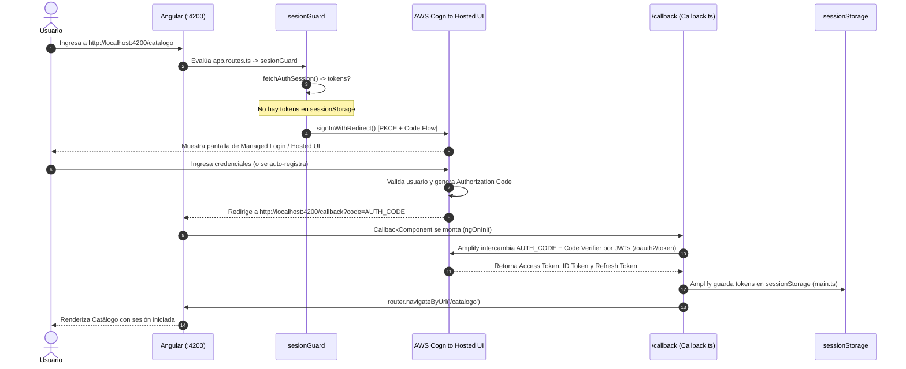
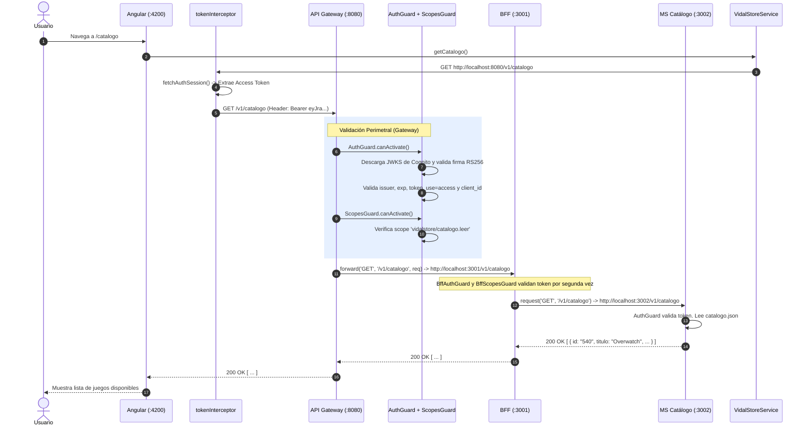
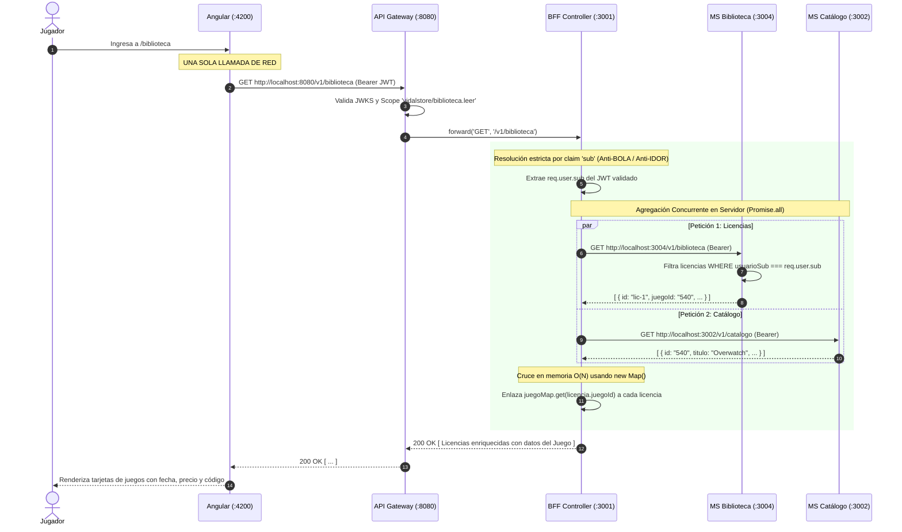
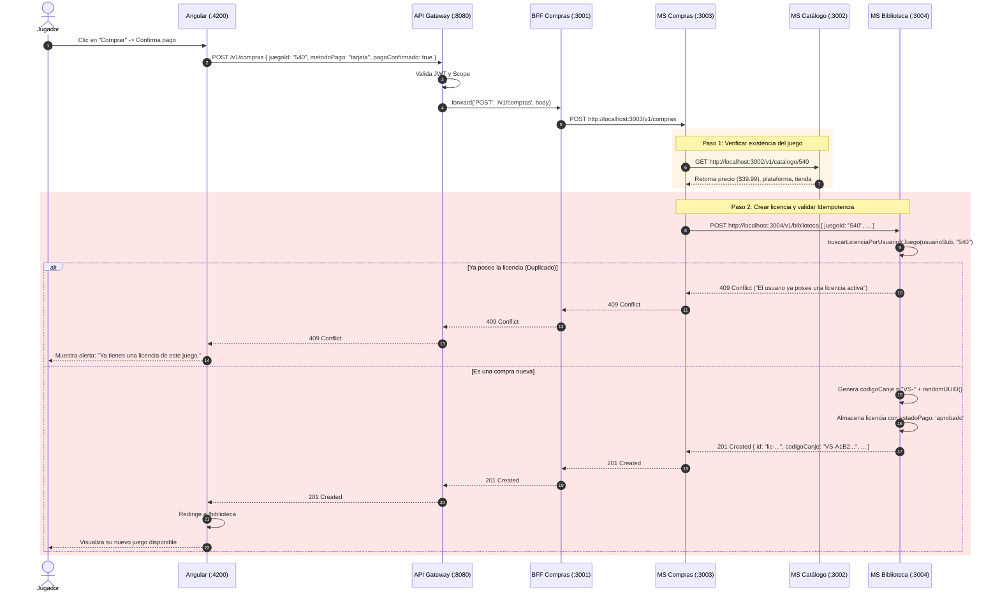
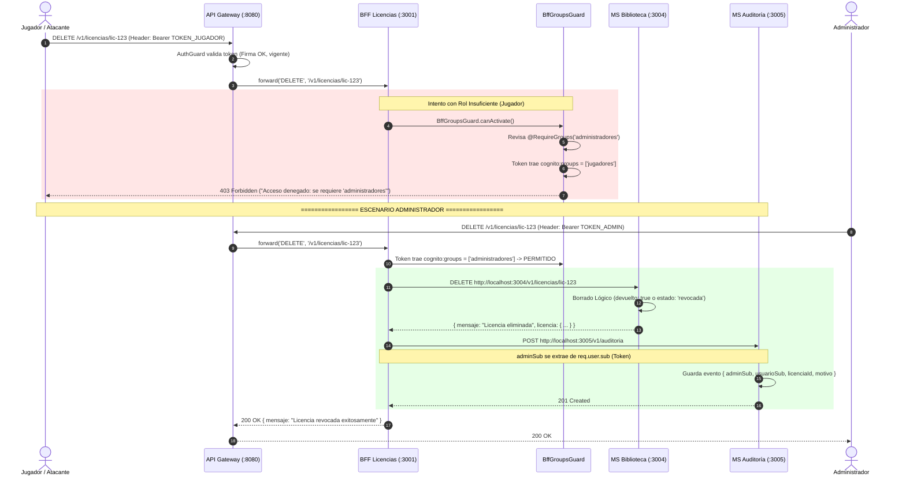

# VidalStore EP1 — Guía Técnica Exhaustiva de Flujos de Punta a Punta

> **Asignatura:** DSY1107 - Desarrollo Cloud Native I (DUOC UC)  
> **Evaluación:** Evaluación Parcial N°1 (EP1) — Caso VidalStore  
> **Propósito:** Documento de estudio, comprensión integral de la arquitectura y defensa técnica individual de 15 minutos.  
> **Repositorios involucrados:** `vidalstore-frontend` (Angular 20), `vidalstore-gateway` (NestJS), `vidalstore-backend` (NestJS BFF y Microservicios), e Identity Provider AWS Cognito.

---

## 📑 Índice General de Flujos

1. [Topología de la Arquitectura de 4 Capas y Puertos](#1-topología-de-la-arquitectura-de-4-capas-y-puertos)
2. [Flujo 1 · Identidad, Registro y Autenticación (Flujo A Oficial)](#2-flujo-1--identidad-registro-y-autenticación-flujo-a-oficial)
3. [Flujo 2 · Consulta de Catálogo (Lectura Autenticada con Scopes)](#3-flujo-2--consulta-de-catálogo-lectura-autenticada-con-scopes)
4. [Flujo 3 · Lo Propio: Biblioteca Personal (Flujo B Oficial · Agregación Concurrente)](#4-flujo-3--lo-propio-biblioteca-personal-flujo-b-oficial--agregación-concurrente)
5. [Flujo 4 · Compra de Juego (Transacción Distribuida e Idempotencia 409)](#5-flujo-4--compra-de-juego-transacción-distribuida-e-idempotencia-409)
6. [Flujo 5 · Rol Insuficiente y Revocación Administrativa (Flujo C Oficial · 403 Forbidden)](#6-flujo-5--rol-insuficiente-y-revocación-administrativa-flujo-c-oficial--403-forbidden)
7. [Flujo 6 · Defensa en Profundidad y Acceso "Por Detrás" (Flujo D Oficial · 401 Unauthorized)](#7-flujo-6--defensa-en-profundidad-y-acceso-por-detrás-flujo-d-oficial--401-unauthorized)
8. [Flujo 7 · Origen y Trazabilidad de Datos (Flujo E Oficial · Seed y API Externa)](#8-flujo-7--origen-y-trazabilidad-de-datos-flujo-e-oficial--seed-y-api-externa)
9. [Flujo 8 · Auditoría y Registro de Trazabilidad Administrativa](#9-flujo-8--auditoría-y-registro-de-trazabilidad-administrativa)
10. [Framework de Defensa Verbal en 4 Pasos (El Reloj de 15 Minutos)](#10-framework-de-defensa-verbal-en-4-pasos-el-reloj-de-15-minutos)

---

## 1. Topología de la Arquitectura de 4 Capas y Puertos

```
[ NAVEGADOR WEB (Cliente) ]
       │
       │  http://localhost:4200 (Angular 20 Standalone)
       ▼
┌────────────────────────────────────────────────────────────────────────┐
│ CAPA 1: FRONTEND (vidalstore-frontend)                                 │
│ Puerto: 4200 | Tecnología: Angular 20 Standalone                       │
│ Responsabilidad: Renderizado SPA, guards de ruta, UI reactiva (signals)│
│ Restricción: Habla con UNA SOLA DIRECCIÓN (http://localhost:8080)      │
└──────────────────────────────────┬─────────────────────────────────────┘
                                   │ HTTP con Authorization: Bearer <JWT>
                                   ▼
┌────────────────────────────────────────────────────────────────────────┐
│ CAPA 2: API GATEWAY (vidalstore-gateway)                               │
│ Puerto: 8080 | Tecnología: NestJS                                      │
│ Responsabilidad: Perímetro de seguridad, CORS estricto (4200),         │
│ validación criptográfica JWKS de Cognito, filtrado por Scopes OAuth2   │
└──────────────────────────────────┬─────────────────────────────────────┘
                                   │ HTTP Forward con Authorization: Bearer <JWT>
                                   ▼
┌────────────────────────────────────────────────────────────────────────┐
│ CAPA 3: BACKEND FOR FRONTEND / BFF (vidalstore-backend)                │
│ Puerto: 3001 | Tecnología: NestJS (src/main.ts)                        │
│ Responsabilidad: Orquestación, agregación concurrente (Promise.all),   │
│ resolución de identidad por 'sub', autorización RBAC por grupos        │
└───────┬──────────────────┬──────────────────┬──────────────────┬───────┘
        │                  │                  │                  │
        │ HTTP (Bearer)    │ HTTP (Bearer)    │ HTTP (Bearer)    │ HTTP (Bearer)
        ▼                  ▼                  ▼                  ▼
┌──────────────┐   ┌──────────────┐   ┌──────────────┐   ┌──────────────┐
│  MS CATÁLOGO │   │  MS COMPRAS  │   │MS BIBLIOTECA │   │ MS AUDITORÍA │
│ Puerto: 3002 │   │ Puerto: 3003 │   │ Puerto: 3004 │   │ Puerto: 3005 │
│ Proceso HTTP │   │ Proceso HTTP │   │ Proceso HTTP │   │ Proceso HTTP │
│ Independiente│   │ Independiente│   │ Independiente│   │ Independiente│
└──────────────┘   └──────────────┘   └──────────────┘   └──────────────┘
        ▲                                                        ▲
        └────────────────────── NUBE AWS ────────────────────────┘
                       AWS Cognito User Pool: us-east-1_psIVfR8PP
                       App Client: 12v3u871cpt4r6tqkm3j66en8i
```

---

## 2. Flujo 1 · Identidad, Registro y Autenticación (Flujo A Oficial)

> **Pregunta de Defensa:** _"¿Cómo pasa un usuario anónimo a ser un sujeto identificado en VidalStore?"_

> ⚡ **Resumen Técnico:** Angular intercepta la navegación con `sesionGuard` (`session.guard.ts`). Al no haber sesión, redirige al Hosted UI de Cognito vía Amplify con flujo Authorization Code + PKCE (`responseType: "code"`). Cognito autentica al usuario y redirige a `http://localhost:4200/callback` con un `code`. El componente `Callback` intercambia el código por tokens contra `/oauth2/token` y los almacena en `sessionStorage` (`cognitoUserPoolsTokenProvider.setKeyValueStorage(sessionStorage)` en `main.ts`). Para resolver la "Trampa de Cognito" (auto-registro sin grupos), el `groups.guard.ts` del backend asigna por omisión en memoria el rol de menor privilegio `["jugadores"]`.
>
> 💡 **En Palabras Simples:** Al intentar entrar a los juegos, el guardia de la puerta (`sesionGuard`) ve que no tienes pulsera y te manda a la boletería oficial de AWS (Cognito Hosted UI). Allí pones tu clave, te dan un vale temporal (`code`) y te mandan a recepción (`/callback`). Recepción cambia el vale por tu pulsera oficial con chip (`JWT`), te la guarda en el bolsillo temporal (`sessionStorage`, para que si cierras la pestaña se destruya) y, como eres nuevo, te asigna la categoría estándar de "jugador común".


### 2.1 Diagrama de Secuencia



### 2.2 Recorrido Paso a Paso en el Código Real

#### Paso 1: Protección de Rutas en Angular

- **Archivo:** [`vidalstore-frontend/src/app/app.routes.ts`](file:///Users/oscar/Downloads/DUOC/CloudNative/Evaluacion%201/vidalstore-frontend/src/app/app.routes.ts#L11-L15)
- **Código:**
  ```typescript
  export const routes: Routes = [
    { path: '', redirectTo: 'catalogo', pathMatch: 'full' },
    { path: 'catalogo', component: Catalogo , canActivate: [sesionGuard] },
    { path: 'biblioteca', component: Biblioteca, canActivate: [sesionGuard] },
    { path: 'callback', component: Callback },
  ```
- **Explicación:** Las rutas `/catalogo` y `/biblioteca` exigen sesión activa. No hay vistas públicas salvo login/callback.

#### Paso 2: El Guard de Sesión y Redirección a Cognito

- **Archivo:** [`vidalstore-frontend/src/app/auth/session.guard.ts`](file:///Users/oscar/Downloads/DUOC/CloudNative/Evaluacion%201/vidalstore-frontend/src/app/auth/session.guard.ts#L4-L15)
- **Código:**
  ```typescript
  export const sesionGuard: CanActivateFn = async () => {
    const { tokens } = await fetchAuthSession();

    // Si existe un access token válido, permite el acceso a la ruta
    if (tokens?.accessToken) {
      return true;
    }

    // Si no hay sesión, redirige automáticamente al Managed Login de Cognito
    await signInWithRedirect();
    return false;
  };
  ```
- **Explicación:** Si no hay token en `sessionStorage`, ejecuta `signInWithRedirect()`, que genera el desafío criptográfico PKCE (`code_challenge`) y redirige al dominio OAuth2 de Cognito.

#### Paso 3: Configuración de Amplify y `sessionStorage` (Obligatorio por Rúbrica)

- **Archivo:** [`vidalstore-frontend/src/main.ts`](file:///Users/oscar/Downloads/DUOC/CloudNative/Evaluacion%201/vidalstore-frontend/src/main.ts#L13-L31)
- **Código:**

  ```typescript
  Amplify.configure({
    Auth: {
      Cognito: {
        userPoolId: "us-east-1_psIVfR8PP",
        userPoolClientId: "12v3u871cpt4r6tqkm3j66en8i",
        loginWith: {
          oauth: {
            domain: "us-east-1psivfr8pp.auth.us-east-1.amazoncognito.com",
            scopes: [
              "openid",
              "profile",
              "vidalstore/catalogo.leer",
              "vidalstore/catalogo.escribir",
              "vidalstore/biblioteca.leer",
            ],
            redirectSignIn: [`${redirectUri}/callback`],
            redirectSignOut: [redirectUri],
            responseType: "code", // PKCE Authorization Code Grant
          },
        },
      },
    },
  });

  cognitoUserPoolsTokenProvider.setKeyValueStorage(sessionStorage);
  ```

- **Punto Clave de Defensa:** Se usa `cognitoUserPoolsTokenProvider.setKeyValueStorage(sessionStorage)` para corregir la vulnerabilidad forense de almacenar credenciales en `localStorage`. Al cerrar la pestaña, la sesión se destruye automáticamente.

#### Paso 4: Captura del Callback y Redirección al Catálogo

- **Archivo:** [`vidalstore-frontend/src/app/callback/callback.ts`](file:///Users/oscar/Downloads/DUOC/CloudNative/Evaluacion%201/vidalstore-frontend/src/app/callback/callback.ts#L16-L27)
- **Código:**
  ```typescript
  async ngOnInit(): Promise<void> {
    try {
      const { tokens } = await fetchAuthSession();
      if (tokens?.accessToken) {
        await this.router.navigateByUrl('/catalogo');
      } else {
        this.estado.set('No se encontró una sesión activa.');
      }
    } catch {
      this.estado.set('No se pudo validar la sesión. Intenta iniciar sesión nuevamente.');
    }
  }
  ```

#### Paso 5: Resolución de la "Trampa de Cognito" en el Backend

- **Problema:** Al auto-registrarse un usuario mediante Hosted UI, AWS Cognito crea el usuario sin asignarlo a ningún grupo (`cognito:groups` viene vacío o ausente en el payload del JWT).
- **Archivo:** [`vidalstore-backend/src/auth/guards/groups.guard.ts`](file:///Users/oscar/Downloads/DUOC/CloudNative/Evaluacion%201/vidalstore-backend/src/auth/guards/groups.guard.ts#L41-L51)
- **Código Real (Salida A Defensiva):**
  ```typescript
  // Salida A defensiva: Si el token no tiene grupos asignados (ej. auto-registro),
  // se asume en memoria el rol de menor privilegio ('jugadores').
  const rawGroups: string[] =
    Array.isArray(user.grupos) && user.grupos.length > 0
      ? user.grupos
      : Array.isArray(user["cognito:groups"])
        ? user["cognito:groups"]
        : [];
  const userGroups: string[] = rawGroups.length > 0 ? rawGroups : ["jugadores"];
  ```
- **Resultado:** Cualquier usuario recién registrado asume el rol de menor privilegio (`jugadores`), pudiendo comprar y ver su biblioteca, pero quedando bloqueado de las rutas administrativas.

---

## 3. Flujo 2 · Consulta de Catálogo (Lectura Autenticada con Scopes)

> **Pregunta de Defensa:** _"¿Por qué el Gateway permite ver el catálogo y cómo se valida que el token sea auténtico?"_

> ⚡ **Resumen Técnico:** Angular invoca `VidalStoreService.getCatalogo()` hacia `http://localhost:8080/v1/catalogo`. El `tokenInterceptor` inyecta la cabecera `Authorization: Bearer <JWT>`. El API Gateway (`:8080`) ejecuta `AuthGuard` (valida criptográficamente el JWT contra el JWKS de Cognito con RS256, vigencia, emisor y `client_id`) y `ScopesGuard` (valida el claim `scope` con `vidalstore/catalogo.leer`). El Gateway reenvía la petición al BFF (`:3001`), que revalida y reenvía vía HTTP al Microservicio de Catálogo (`:3002`), el cual retorna `catalogo.json` con código `200 OK`.
>
> 💡 **En Palabras Simples:** Quieres ver los juegos disponibles. Tu navegador le pega tu sello digital (`Bearer Token`) a la carta. La caseta de guardia perimetral (Gateway en puerto 8080) revisa que el sello sea auténtico de AWS y que tengas permiso de "mirar vitrina" (`scope`). Si todo está en orden, se la pasa al recepcionista (BFF), quien le pide la lista a la bodega de catálogo (puerto 3002) y te la devuelve lista en pantalla.


### 3.1 Diagrama de Secuencia



### 3.2 Recorrido Paso a Paso en el Código Real

#### Paso 1: Llamada en el Servicio Angular

- **Archivo:** [`vidalstore-frontend/src/app/services/vidalstore.ts`](file:///Users/oscar/Downloads/DUOC/CloudNative/Evaluacion%201/vidalstore-frontend/src/app/services/vidalstore.ts#L61-L64)
- **Código:**
  ```typescript
  getCatalogo(): Observable<Juego[]> {
    return this.http.get<Juego[]>(`${this.gatewayUrl}/v1/catalogo`);
  }
  ```
- **Regla Estricta:** La URL apunta **exclusivamente** a `http://localhost:8080` (Gateway).

#### Paso 2: Interceptor Inyecta el JWT en la Cabecera

- **Archivo:** [`vidalstore-frontend/src/app/auth/token.interceptor.ts`](file:///Users/oscar/Downloads/DUOC/CloudNative/Evaluacion%201/vidalstore-frontend/src/app/auth/token.interceptor.ts#L5-L24)
- **Código:**

  ```typescript
  const PERMITIDOS = ["http://localhost:8080"];

  export const tokenInterceptor: HttpInterceptorFn = (req, next) => {
    const esPermitido =
      PERMITIDOS.some((base) => req.url.startsWith(base)) ||
      req.url.startsWith("/v1");
    if (!esPermitido) {
      return next(req);
    }

    return from(fetchAuthSession()).pipe(
      switchMap(({ tokens }) => {
        const jwt = tokens?.accessToken?.toString();
        const setHeaders: Record<string, string> = {
          "ngrok-skip-browser-warning": "true",
        };
        if (jwt) {
          setHeaders["Authorization"] = `Bearer ${jwt}`;
        }
        return next(req.clone({ setHeaders }));
      }),
    );
  };
  ```

#### Paso 3: Validación Criptográfica en el Gateway (`AuthGuard` + `AuthService`)

- **Archivo:** [`vidalstore-gateway/src/gateway.controller.ts`](file:///Users/oscar/Downloads/DUOC/CloudNative/Evaluacion%201/vidalstore-gateway/src/gateway.controller.ts#L24-L30)
- **Código:**
  ```typescript
  @Get('catalogo')
  @UseGuards(AuthGuard, ScopesGuard)
  @RequireScopes('vidalstore/catalogo.leer')
  async getCatalogo(@Request() req: ExpressRequest) {
    return this.gatewayService.forward('GET', '/v1/catalogo', req);
  }
  ```
- **Archivo:** [`vidalstore-gateway/src/auth/auth.service.ts`](file:///Users/oscar/Downloads/DUOC/CloudNative/Evaluacion%201/vidalstore-gateway/src/auth/auth.service.ts#L20-L66)
  1. Extrae el `kid` del header del token.
  2. Obtiene la clave pública desde el JWKS de AWS Cognito (`jwks-rsa`).
  3. Ejecuta `jwt.verify(token, publicKey, { algorithms: ['RS256'], issuer })`.
  4. Valida que `payload.token_use === 'access'`.
  5. Valida que `payload.client_id === process.env.COGNITO_CLIENT_ID`.
  6. Si alguna falla, lanza `UnauthorizedException` (`401`).

#### Paso 4: Validación de Scopes en el Gateway (`ScopesGuard`)

- **Archivo:** [`vidalstore-gateway/src/auth/scopes.guard.ts`](file:///Users/oscar/Downloads/DUOC/CloudNative/Evaluacion%201/vidalstore-gateway/src/auth/scopes.guard.ts#L33-L47)
- **Código:**

  ```typescript
  const tokenScopeString: string = user.scope || "";
  const userScopes = tokenScopeString
    .split(" ")
    .map((s) => s.trim())
    .filter(Boolean);

  const hasAllScopes = requiredScopes.every((scope) =>
    userScopes.includes(scope),
  );
  if (!hasAllScopes) {
    throw new ForbiddenException(
      `Acceso denegado: falta el scope requerido...`,
    );
  }
  ```

#### Paso 5: Forward y Despacho del Microservicio Catálogo

- **Archivo:** [`vidalstore-gateway/src/gateway.service.ts`](file:///Users/oscar/Downloads/DUOC/CloudNative/Evaluacion%201/vidalstore-gateway/src/gateway.service.ts#L14-L37)
  - Hace fetch a `http://localhost:3001/v1/catalogo` reenviando el `Authorization: Bearer <token>`.
- **Archivo:** [`vidalstore-backend/src/bff/catalogo/bff-catalogo.controller.ts`](file:///Users/oscar/Downloads/DUOC/CloudNative/Evaluacion%201/vidalstore-backend/src/bff/catalogo/bff-catalogo.controller.ts#L29-L39)
  - Reenvía la petición al microservicio de Catálogo en `http://localhost:3002/v1/catalogo`.
- **Archivo:** [`vidalstore-backend/src/microservicios/catalogo/catalogo.controller.ts`](file:///Users/oscar/Downloads/DUOC/CloudNative/Evaluacion%201/vidalstore-backend/src/microservicios/catalogo/catalogo.controller.ts#L26-L29)
  - Retorna el catálogo cargado en memoria desde `catalogo.json` con código HTTP `200 OK`.

---

## 4. Flujo 3 · Lo Propio: Biblioteca Personal (Flujo B Oficial · Agregación Concurrente)

> **Pregunta de Defensa:** _"¿Cómo garantiza VidalStore que un jugador solo vea sus propios juegos y cómo se optimiza la consulta?"_

> ⚡ **Resumen Técnico:** El frontend realiza **una sola llamada de red** a `GET http://localhost:8080/v1/biblioteca`. El Gateway valida token y scope `vidalstore/biblioteca.leer`. En el BFF (`:3001`), `bff-biblioteca.controller.ts` extrae la identidad **únicamente del claim `sub` del token** (`@CurrentUser("sub")`), previniendo vulnerabilidades BOLA/IDOR al no aceptar `userId` por parámetro. El BFF lanza concurrentemente con `Promise.all` dos peticiones: a MS Biblioteca (`:3004/v1/biblioteca`, que filtra por `sub`) y a MS Catálogo (`:3002/v1/catalogo`). Luego cruza en memoria en $O(N)$ usando `new Map()` para enriquecer cada licencia con los datos de su juego y retorna `200 OK` (o `[]` si está vacía).
>
> 💡 **En Palabras Simples:** Quieres ver tus juegos comprados. Haces una sola pregunta a la entrada. La regla de oro es que **tú nunca dices tu ID**: tu identidad la dice el chip inalterable de tu pulsera (`sub`). El recepcionista interno (BFF), para no hacerte esperar el doble, manda dos mensajeros al mismo tiempo (`Promise.all`): uno a la bodega de licencias (puerto 3004) a buscar tus contratos y otro a la de catálogo (puerto 3002) a traer títulos y carátulas. En su escritorio junta cada juego con su código usando un casillero rápido (`Map`) y te entrega tu colección completa en un solo paquete. Si no tienes juegos, responde amablemente "tienes 0 juegos" (`200 OK []`), jamás un error.


### 4.1 Diagrama de Secuencia



### 4.2 Recorrido Paso a Paso en el Código Real

#### Paso 1: Prohibición de Parámetro `userId` (Prevención de Vulnerabilidad BOLA/IDOR)

- En VidalStore está **estrictamente prohibido** enviar `GET /v1/biblioteca?userId=123` o `GET /v1/biblioteca/usuario/123`.
- Si se aceptara el ID por URL o body, cualquier usuario podría cambiar el número e inspeccionar la biblioteca de otra persona.
- La identidad se extrae **exclusivamente del claim criptográfico `sub`** inalterable del JWT.

#### Paso 2: El Controlador del BFF y la Agregación con `Promise.all`

- **Archivo:** [`vidalstore-backend/src/bff/biblioteca/bff-biblioteca.controller.ts`](file:///Users/oscar/Downloads/DUOC/CloudNative/Evaluacion%201/vidalstore-backend/src/bff/biblioteca/bff-biblioteca.controller.ts#L20-L58)
- **Código:**

  ```typescript
  @Get()
  @UseGuards(BffAuthGuard)
  async obtenerBiblioteca(
    @CurrentUser('sub') usuarioSub: string,
    @Req() req?: any,
  ) {
    if (!usuarioSub) {
      throw new UnauthorizedException(
        'No se pudo resolver la identidad del usuario a partir del claim sub del token.',
      );
    }

    const authHeader = req?.headers?.['authorization'];

    // Agregación concurrente en servidor con Promise.all (latencia max(T1, T2))
    const [licencias, catalogo] = await Promise.all([
      this.bffHttpService.request<Licencia[]>(
        this.bffHttpService.bibliotecaUrl,
        'GET',
        '/v1/biblioteca',
        authHeader,
      ),
      this.bffHttpService
        .request<Juego[]>(
          this.bffHttpService.catalogoUrl,
          'GET',
          '/v1/catalogo',
          authHeader,
        )
        .catch(() => [] as Juego[]),
    ]);

    // Cruce de datos O(N) con Map
    const juegoMap = new Map<string, Juego>(catalogo.map((j) => [j.id, j]));

    return licencias.map((licencia) => ({
      ...licencia,
      juego: juegoMap.get(licencia.juegoId) ?? null,
    }));
  }
  ```

#### Paso 3: Filtrado en el Microservicio de Biblioteca

- **Archivo:** [`vidalstore-backend/src/microservicios/biblioteca/biblioteca.controller.ts`](file:///Users/oscar/Downloads/DUOC/CloudNative/Evaluacion%201/vidalstore-backend/src/microservicios/biblioteca/biblioteca.controller.ts#L23-L27)
- **Código:**
  ```typescript
  @Get()
  obtenerBiblioteca(@Req() req: any) {
    const usuarioSub = req.user?.sub;
    return this.bibliotecaService.buscarLicenciasPorUsuario(usuarioSub);
  }
  ```
- **Regla Semántica HTTP:** Si el usuario no tiene ninguna licencia, retorna **`200 OK` con un arreglo vacío `[]`**. Jamás 404 ni 403 (evita vulnerabilidad de enumeración de recursos).

---

## 5. Flujo 4 · Compra de Juego (Transacción Distribuida e Idempotencia 409)

> **Pregunta de Defensa:** _"¿Qué pasa si un usuario presiona dos veces el botón de comprar o compra un juego que ya tiene?"_

> ⚡ **Resumen Técnico:** Angular envía `POST http://localhost:8080/v1/compras` con `{ juegoId, metodoPago, pagoConfirmado }`. El Gateway reenvía al BFF (`:3001`) y este al MS Compras (`:3003`). `ComprasService` extrae `sub` del JWT y llama vía HTTP a MS Catálogo (`:3002`) para verificar existencia y precio real. Luego solicita a MS Biblioteca (`:3004`) crear la licencia. `BibliotecaService` valida idempotencia: si ya existe una licencia para ese `usuarioSub` y `juegoId`, retorna **`409 Conflict`**. Si es nueva, genera un `codigoCanje` único (`VS-XXXX...`), almacena la licencia con `estadoPago: "aprobado"` y retorna `201 Created`.
>
> 💡 **En Palabras Simples:** Haces clic en "Comprar". Tu pedido pasa al encargado de ventas (MS Compras). Primero llama por teléfono interno a bodega (Catálogo) para comprobar que el juego exista y cuál es su precio real (evitando que el usuario manipule el precio desde el navegador). Si existe, llama a la notaría de licencias (Biblioteca). La notaría revisa su libro: si ve que ya tienes ese juego, te frena en seco con un `409 Conflict` ("¡Ya tienes este juego, no te lo puedo duplicar!"). Si es nuevo, genera un código de canje oficial (`VS-...`), lo registra a tu nombre y te confirma la adquisición (`201 Created`).


### 5.1 Diagrama de Secuencia



### 5.2 Recorrido Paso a Paso en el Código Real

#### Paso 1: Orquestación en el Microservicio de Compras

- **Archivo:** [`vidalstore-backend/src/microservicios/compras/compras.service.ts`](file:///Users/oscar/Downloads/DUOC/CloudNative/Evaluacion%201/vidalstore-backend/src/microservicios/compras/compras.service.ts#L41-L82)
- **Código:**

  ```typescript
  // 1. Verificar que el juego exista preguntándole al microservicio de Catálogo
  const juego = await this.comprasHttpService.request<{
    precio?: number;
    plataforma?: Licencia["plataforma"];
    tienda?: Licencia["tienda"];
    region?: Licencia["region"];
  }>(
    this.comprasHttpService.catalogoUrl,
    "GET",
    `/v1/catalogo/${juegoId}`,
    token,
  );

  // 2. Crear la licencia en el microservicio de Biblioteca
  const datosLicencia = {
    juegoId,
    plataforma: juego.plataforma,
    tienda: juego.tienda,
    region: juego.region,
    metodoPago,
    referenciaPago: `SIM-${Date.now()}`,
    precioPagado: juego.precio,
    estadoPago: "aprobado" as const,
  };

  return this.comprasHttpService.request<Licencia>(
    this.comprasHttpService.bibliotecaUrl,
    "POST",
    "/v1/biblioteca",
    token,
    datosLicencia,
  );
  ```

#### Paso 2: Validación de Idempotencia y Generación en Biblioteca

- **Archivo:** [`vidalstore-backend/src/microservicios/biblioteca/biblioteca.service.ts`](file:///Users/oscar/Downloads/DUOC/CloudNative/Evaluacion%201/vidalstore-backend/src/microservicios/biblioteca/biblioteca.service.ts#L49-L62)
- **Código:**

  ```typescript
  const licenciaExistente = this.buscarLicenciaPorUsuarioYJuego(
    usuarioSub,
    licenciaDatos.juegoId,
  );
  if (licenciaExistente) {
    throw new ConflictException(
      `El usuario ya posee una licencia activa para el juego con ID '${licenciaDatos.juegoId}'.`,
    );
  }

  return this.storageService.agregarLicencia({
    ...licenciaDatos,
    usuarioSub,
    codigoCanje: `VS-${randomUUID().replaceAll("-", "").slice(0, 16).toUpperCase()}`,
    estadoPago: "aprobado",
  });
  ```

- **Por qué 409 Conflict:** Cumple el estándar REST de idempotencia. Evita cobros dobles y duplicación de licencias para un mismo usuario.

---

## 6. Flujo 5 · Rol Insuficiente y Revocación Administrativa (Flujo C Oficial · 403 Forbidden)

> **Pregunta de Defensa:** _"¿Qué pasa si un atacante envía una petición con un token válido de jugador para revocar una licencia o ver datos de otros?"_

> ⚡ **Resumen Técnico:** Demostración de RBAC y seguridad en el servidor. Si un usuario con rol `jugadores` intenta ejecutar `DELETE /v1/licencias/:id`, el Gateway valida la firma del token y reenvía al BFF (`:3001`). `BffLicenciasController` cuenta con el decorador `@RequireGroups("administradores")`. `BffGroupsGuard` inspecciona `cognito:groups` en el JWT; al no encontrar `administradores`, corta inmediatamente con **`403 Forbidden`**, comprobando que la seguridad reside en el servidor y no en la UI. Cuando lo invoca un administrador legítimo, el BFF ejecuta borrado lógico en MS Biblioteca (`:3004`) y registra en MS Auditoría (`:3005`) el evento con `adminSub`, `usuarioSub`, `juegoId` y motivo, respondiendo `200 OK`.
>
> 💡 **En Palabras Simples:** Un cliente común intenta meterse a la oficina de administración para revocarle un juego a otra persona. Aunque su pulsera sea original, el guardia del pasillo (`BffGroupsGuard`) mira su rango y le dice: "Tu pulsera es válida, pero eres cliente y esto es exclusivo para administradores", cerrándole la puerta con un `403 Prohibido`. Esto demuestra que aunque alguien hackee la pantalla o muestre botones ocultos, el servidor nunca lo deja pasar. Si entra el administrador real, anula la licencia marcándola como devuelta (borrado lógico para no borrar el historial) y anota en el libro de seguridad (Auditoría) quién fue, a quién se la quitó y el motivo.


### 6.1 Diagrama de Secuencia



### 6.2 Recorrido Paso a Paso en el Código Real

#### Paso 1: El Guard de Grupos del BFF (`BffGroupsGuard`)

- **Archivo:** [`vidalstore-backend/src/auth/guards/groups.guard.ts`](file:///Users/oscar/Downloads/DUOC/CloudNative/Evaluacion%201/vidalstore-backend/src/auth/guards/groups.guard.ts#L52-L60)
- **Código:**

  ```typescript
  const hasAnyGroup = requiredGroups.some((group) =>
    userGroups.includes(group),
  );

  if (!hasAnyGroup) {
    throw new ForbiddenException(
      `Acceso denegado: se requiere pertenecer a uno de los grupos [${requiredGroups.join(", ")}]. Grupos actuales del usuario: [${userGroups.join(", ")}]`,
    );
  }
  ```

- **Principio de Seguridad:** Demuestra que **la seguridad reside en el servidor**, no en si el botón de revocar está visible o no en Angular.

#### Paso 2: Revocación y Trazabilidad en Auditoría

- **Archivo:** [`vidalstore-backend/src/bff/biblioteca/bff-licencias.controller.ts`](file:///Users/oscar/Downloads/DUOC/CloudNative/Evaluacion%201/vidalstore-backend/src/bff/biblioteca/bff-licencias.controller.ts#L56-L108)
- **Código:**

  ```typescript
  @Delete(':licenciaId')
  @UseGuards(BffAuthGuard, BffGroupsGuard)
  @RequireGroups('administradores')
  async revocarLicencia(
    @Param('licenciaId') licenciaId: string,
    @CurrentUser('sub') adminSub: string,
    @Req() req?: any,
  ) {
    // 1. Eliminar licencia en microservicio de biblioteca
    const deleteResult = await this.bffHttpService.request<{
      mensaje: string;
      licencia: Licencia;
    }>(
      this.bffHttpService.bibliotecaUrl,
      'DELETE',
      `/v1/licencias/${licenciaId}`,
      authHeader,
    );

    // 2. Registrar evento en microservicio de auditoría
    await this.bffHttpService.request(
      this.bffHttpService.auditoriaUrl,
      'POST',
      '/v1/auditoria',
      authHeader,
      {
        adminSub: adminSub || 'admin',
        usuarioSub: licencia?.usuarioSub || 'desconocido',
        juegoId: licencia?.juegoId || 'desconocido',
        licenciaId,
        motivo: 'Revocación administrativa',
      },
    );
  ```

---

## 7. Flujo 6 · Defensa en Profundidad y Acceso "Por Detrás" (Flujo D Oficial · 401 Unauthorized)

> **Pregunta de Defensa:** _"Si un atacante descubre la IP y el puerto del BFF (3001) o de un microservicio (3004) y se salta el Gateway, ¿puede acceder a los datos?"_

> ⚡ **Resumen Técnico:** Arquitectura de defensa en profundidad en dos saltos y cero confianza. Si una petición llega al Gateway sin cabecera `Authorization`, `AuthGuard` responde `401 Unauthorized`. Si un atacante descubre la IP/puerto del BFF (`:3001`) o de un microservicio (`:3004`) e intenta saltarse el Gateway llamando directo sin token, cada servicio posee su propio `AuthGuard` y corta con **`401 Unauthorized`** (no hay confianza ciega downstream). Si el token tiene firma alterada o un `client_id` ajeno a la aplicación, `AuthService` lo rechaza con `401`. Además, CORS está habilitado **exclusivamente en el Gateway** (`http://localhost:4200`); BFF y microservicios bloquean peticiones cross-origin directas del navegador.
>
> 💡 **En Palabras Simples:** Es como un castillo con doble muralla. La primera muralla es el Gateway: si llegas sin invitación, no pasas (`401`). Si un intruso descubre la puerta trasera de la cocina (BFF) o del depósito (microservicios), cada cuarto tiene su propio guardia con lector de pulseras que exige credencial válida firmada por AWS. Ningún cuarto interno asume que "si estás aquí es porque ya te revisaron afuera". Y si la pulsera está raspada o falsificada, salta la alarma. Además, las puertas traseras no atienden a nadie que venga desde navegadores externos (CORS bloqueado).


### 7.1 Matriz de Comportamiento Defensivo

| Intento de Ataque             | Destino                 | Cabecera / Condición       |  Código de Respuesta   | Componente que corta       |
| ----------------------------- | ----------------------- | -------------------------- | :--------------------: | -------------------------- |
| Petición sin token            | Gateway (`:8080`)       | Sin `Authorization`        | **`401 Unauthorized`** | `Gateway AuthGuard`        |
| Petición sin token directa    | BFF (`:3001`)           | Sin `Authorization`        | **`401 Unauthorized`** | `BFF BffAuthGuard`         |
| Petición sin token directa    | MS Biblioteca (`:3004`) | Sin `Authorization`        | **`401 Unauthorized`** | `Microservicio AuthGuard`  |
| Token con firma alterada      | Gateway o BFF           | Firma adulterada           | **`401 Unauthorized`** | `AuthService.validarToken` |
| Token de otra App (Client 2)  | Gateway o BFF           | `client_id` diferente      | **`401 Unauthorized`** | `AuthService.validarToken` |
| Petición cross-origin directa | BFF o Microservicio     | Desde navegador (`Origin`) |    **Bloqueo CORS**    | No tienen CORS habilitado  |

### 7.2 Recorrido en el Código Real

#### 1. Validación en el Salto del Perímetro (Gateway)

- **Archivo:** [`vidalstore-gateway/src/auth/auth.guard.ts`](file:///Users/oscar/Downloads/DUOC/CloudNative/Evaluacion%201/vidalstore-gateway/src/auth/auth.guard.ts#L18-L24)
- **Código:**
  ```typescript
  if (!token) {
    throw new UnauthorizedException("No se encontró token Bearer");
  }
  const payload = await this.authService.validateToken(token);
  ```

#### 2. Validación en el Segundo Salto (BFF y Microservicios - "Cierre por Detrás")

- **Archivo:** [`vidalstore-backend/src/auth/guards/auth.guard.ts`](file:///Users/oscar/Downloads/DUOC/CloudNative/Evaluacion%201/vidalstore-backend/src/auth/guards/auth.guard.ts#L24-L34)
- **Código:**
  ```typescript
  if (!authHeader || !authHeader.startsWith("Bearer ")) {
    throw new UnauthorizedException(
      "Cabecera Authorization ausente o con formato inválido (debe iniciar con Bearer <token>)",
    );
  }
  const payload = await this.authService.validarToken(token);
  ```

#### 3. Rechazo de Token de Otro App Client

- **Archivo:** [`vidalstore-backend/src/auth/auth.service.ts`](file:///Users/oscar/Downloads/DUOC/CloudNative/Evaluacion%201/vidalstore-backend/src/auth/auth.service.ts#L57-L67)
- **Código:**
  ```typescript
  const expectedClientId = process.env.COGNITO_CLIENT_ID;
  if (
    expectedClientId &&
    cognitoPayload.client_id &&
    cognitoPayload.client_id !== expectedClientId
  ) {
    throw new UnauthorizedException(
      `Client ID no autorizado: el token pertenece a '${cognitoPayload.client_id}', pero se esperaba '${expectedClientId}'`,
    );
  }
  ```

#### 4. CORS Estricto Únicamente en el Gateway

- **Archivo:** [`vidalstore-gateway/src/main.ts`](file:///Users/oscar/Downloads/DUOC/CloudNative/Evaluacion%201/vidalstore-gateway/src/main.ts#L12-L16)
- **Código:**
  ```typescript
  app.enableCors({
    origin: "http://localhost:4200",
    methods: ["GET", "POST", "PUT", "DELETE", "OPTIONS"],
    allowedHeaders: [
      "Content-Type",
      "Authorization",
      "ngrok-skip-browser-warning",
    ],
  });
  ```
- **Archivo:** [`vidalstore-backend/src/main.ts`](file:///Users/oscar/Downloads/DUOC/CloudNative/Evaluacion%201/vidalstore-backend/src/main.ts#L8-L10)
  - Prohibido activar CORS en BFF o microservicios.

---

## 8. Flujo 7 · Origen y Trazabilidad de Datos (Flujo E Oficial · Seed y API Externa)

> **Pregunta de Defensa:** _"¿De dónde salieron los datos del catálogo que estamos viendo en pantalla?"_

> ⚡ **Resumen Técnico:** Los datos del catálogo no son ficticios ni estáticos. Al ejecutar `npm run seed`, el script `data/seed.ts` consume la API REST real de videojuegos FreeToGame (`https://www.freetogame.com/api/games`), mapea los atributos al modelo institucional `Juego` y guarda los datos en `data/catalogo.json` versionado en Git. Dispone de un arreglo `FALLBACK_JUEGOS` para asegurar resiliencia en caso de que el laboratorio DUOC tenga bloqueo de red hacia internet. Al arrancar, los microservicios cargan este JSON en memoria mediante `MemoryStorageService`.
>
> 💡 **En Palabras Simples:** Los juegos de la tienda no se inventaron a mano. Hay un robot abastecedor (`seed.ts`) que se conecta a internet a un catálogo real de videojuegos del mundo, transforma la información al formato que pide la tienda y la deja archivada en un archivo oficial (`catalogo.json`). Y si el día del examen se corta internet en el laboratorio, el robot tiene un maletín de respaldo con juegos listos para que la tienda nunca se quede vacía.


### 8.1 Recorrido en el Código Real

- **Comando:** `npm run seed` en `vidalstore-backend`
- **Archivo:** [`vidalstore-backend/data/seed.ts`](file:///Users/oscar/Downloads/DUOC/CloudNative/Evaluacion%201/vidalstore-backend/data/seed.ts#L90-L160)
- **Operación:**
  1. Realiza una petición `fetch` a la API real de juegos: `https://www.freetogame.com/api/games`.
  2. Mapea los atributos externos al modelo institucional `Juego` de VidalStore (`id`, `titulo`, `descripcion`, `precio`, `estado`, `imagen`, `plataforma`, `tienda`, `region`).
  3. Contiene un arreglo de respaldo (`FALLBACK_JUEGOS`) que garantiza resiliencia en caso de que la red del laboratorio de DUOC tenga bloqueo de firewall hacia internet.
  4. Escribe el archivo versionado [`vidalstore-backend/data/catalogo.json`](file:///Users/oscar/Downloads/DUOC/CloudNative/Evaluacion%201/vidalstore-backend/data/catalogo.json).
  5. Los microservicios inyectan este JSON al arrancar mediante `MemoryStorageService`.

---

## 9. Flujo 8 · Auditoría y Registro de Trazabilidad Administrativa

> **Requisito Obligatorio:** Grupos de 3 integrantes (David, Oscar e Iván).

> ⚡ **Resumen Técnico:** Requisito obligatorio para grupos de 3 integrantes. Microservicio independiente en puerto `3005` (`MS Auditoría`). Cada acción administrativa crítica (como revocación de licencias) dispara un `POST /v1/auditoria` inmutable. Los administradores consultan la bitácora con `GET /v1/auditoria`, recibiendo un arreglo con `id`, `adminSub` (extraído del JWT del administrador actuante), `usuarioSub`, `juegoId`, `licenciaId`, `motivo` y marca de tiempo ISO-8601 (`timestamp`).
>
> 💡 **En Palabras Simples:** Es la caja negra o el libro de novedades del banco. Cada vez que un jefe toma una decisión delicada (como anularle la compra a un usuario), el sistema anota en una libreta protegida (puerto 3005) exactamente qué pasó: qué administrador actuó (su firma `sub`), a quién afectó, qué juego fue, el motivo y el segundo exacto. Nadie puede borrar esa libreta y los administradores pueden revisarla cuando quieran para garantizar transparencia total.


### 9.1 Recorrido en el Código Real

- **Microservicio:** `vidalstore-backend/src/microservicios/auditoria` (Puerto `3005`).
- **Archivo:** [`vidalstore-backend/src/microservicios/auditoria/auditoria.controller.ts`](file:///Users/oscar/Downloads/DUOC/CloudNative/Evaluacion%201/vidalstore-backend/src/microservicios/auditoria/auditoria.controller.ts#L28-L33)
- **Registro Inmutable:**
  ```typescript
  @Post()
  @HttpCode(HttpStatus.CREATED)
  registrarAuditoria(@Body() dto: RegistrarAuditoriaDto) {
    return this.auditoriaService.registrarAuditoria(dto);
  }
  ```
- **Campos registrados:**
  - `id`: Identificador autoincremental o UUID.
  - `adminSub`: Extraído del claim `sub` del administrador que ejecutó la acción.
  - `usuarioSub`: Sujeto al que se le aplicó la acción (ej: usuario cuya licencia fue revocada).
  - `juegoId` / `licenciaId`: Identificadores de negocio afectados.
  - `motivo`: Descripción de la operación.
  - `timestamp`: Marca de tiempo ISO-8601.

---

## 10. Framework de Defensa Verbal en 4 Pasos (El Reloj de 15 Minutos)

Durante los 15 minutos cronometrados de la defensa individual de la EP1, cuando el profesor Umbingelelo te ponga el cursor sobre un archivo o te pregunte por qué hiciste algo, responde usando esta estructura exacta de 1 minuto:

```
┌────────────────────────────────────────────────────────────────────────┐
│ PASO 1: QUÉ HICE                                                       │
│ "En [nombre del archivo], definí [nombre de la clase/función]..."     │
├────────────────────────────────────────────────────────────────────────┤
│ PASO 2: QUÉ PROBLEMA RESUELVE                                          │
│ "Esto resuelve [problema de seguridad/rendimiento/arquitectura]..."    │
├────────────────────────────────────────────────────────────────────────┤
│ PASO 3: QUÉ DESCARTÉ (El que más pesa)                                │
│ "Descarté [alternativa rechazada] porque [motivo técnico concreto]..." │
├────────────────────────────────────────────────────────────────────────┤
│ PASO 4: CÓMO LO COMPRUEBO                                              │
│ "Lo demuestro aquí en la pantalla con [curl / Pestaña Red / Token]..." │
└────────────────────────────────────────────────────────────────────────┘
```

### Ejemplos Prácticos Listos para Usar en la Defensa:

#### Caso A: Resolución de Biblioteca por `sub`

1. **Qué hice:** En `bff-biblioteca.controller.ts` línea 23, inyecté el claim `sub` con `@CurrentUser('sub')`.
2. **Qué problema resuelve:** Evita vulnerabilidades de BOLA/IDOR (Broken Object Level Authorization). Ningún jugador puede ver la biblioteca de otro.
3. **Qué descarté:** Descarté recibir el `userId` como parámetro de ruta o query (`/biblioteca?userId=xxx`).
4. **Cómo lo compruebo:** Muestro en la pestaña Red que Angular solo llama a `/v1/biblioteca` sin parámetros y el backend devuelve únicamente mis juegos.

#### Caso B: Guardado en `sessionStorage`

1. **Qué hice:** En `main.ts` de Angular línea 31, configuré `cognitoUserPoolsTokenProvider.setKeyValueStorage(sessionStorage)`.
2. **Qué problema resuelve:** Protege los tokens de persistencia indebida. Si el usuario cierra el navegador o pestaña, el token se borra automáticamente.
3. **Qué descarté:** Descarté `localStorage` (hallazgo forense del caso) y cookies no seguras.
4. **Cómo lo compruebo:** Abro la pestaña `Application` en DevTools y muestro los tokens en `Session Storage`, mientras `Local Storage` se encuentra vacío.

#### Caso C: Agregación en el BFF con `Promise.all`

1. **Qué hice:** En `bff-biblioteca.controller.ts` línea 35, ejecuté `Promise.all` para consultar concurrentemente al microservicio de Biblioteca y Catálogo.
2. **Qué problema resuelve:** Reduce la latencia al tiempo del servicio más lento (`max(T1, T2)` en lugar de `T1 + T2`) y evita que el frontend haga múltiples viajes de red.
3. **Qué descarté:** Descarté llamadas secuenciales con `await` encadenados y descarté que Angular llamara directamente a los dos microservicios.
4. **Cómo lo compruebo:** Inspecciono la pestaña Red del navegador para demostrar que el navegador hace una sola petición HTTP y recibe el JSON completo con los datos del juego ya cruzados.

---

## 11. Glosario Técnico y Arquitectónico de VidalStore

Este glosario reúne todos los conceptos teóricos, siglas, estándares y patrones de diseño utilizados en VidalStore. Para cada término encontrarás su definición técnica rigurosa (con su impacto en el código real) y una analogía en palabras sencillas para defenderlo con soltura ante cualquier pregunta de la comisión evaluadora.

---

### 11.1 Seguridad, Identidad y Tokens

#### 1. JWT (JSON Web Token — RFC 7519)
- ⚡ **Definición Técnica:** Estándar abierto y compacto que define una forma autónoma (*self-contained*) y segura de transmitir información entre partes como un objeto JSON. Se compone de 3 partes separadas por puntos y codificadas en Base64Url: `Header.Payload.Signature`. En VidalStore es *stateless* (sin estado): el servidor no guarda sesiones en memoria ni en base de datos; la validez del token se corrobora matemáticamente mediante la firma digital asimétrica RSA-SHA256 generada por AWS Cognito.
- 💡 **En Palabras Simples:** Es como un carnet de conducir con holograma infalsificable. Cuando te lo piden, la policía no necesita llamar a la oficina central de tránsito para saber quién eres; simplemente revisa que el sello holográfico esté intacto y que la fecha de vencimiento no haya pasado.

#### 2. `iss` (Issuer / Emisor)
- ⚡ **Definición Técnica:** Claim estándar del payload del JWT que identifica la entidad que emitió el token (en nuestro caso, AWS Cognito). Su valor exacto es `https://cognito-idp.us-east-1.amazonaws.com/us-east-1_psIVfR8PP`. El servicio de autenticación de NestJS (`AuthService`) valida obligatoriamente que el `iss` del token recibido coincida con el User Pool oficial para prevenir que un atacante presente un token válido emitido por otro servidor de autenticación ajeno.
- 💡 **En Palabras Simples:** Es el sello de agua que dice de qué notaría salió el documento. Si el documento dice que viene de una notaría falsa o desconocida, el guardia lo rompe de inmediato y no te deja pasar.

#### 3. `sub` (Subject / Sujeto)
- ⚡ **Definición Técnica:** Claim fundamental del payload del JWT que representa el identificador único universal (UUID v4) del usuario dentro del Identity Provider (ej: `a1b2c3d4-e5f6-7890-abcd-1234567890ab`). En VidalStore actúa como la clave foránea canónica para relacionar compras, licencias de biblioteca y registros de auditoría. Es la columna vertebral de la prevención contra BOLA/IDOR: el cliente nunca envía su `userId` por parámetro, sino que el backend lo extrae de forma infalsificable del `sub` del token autenticado.
- 💡 **En Palabras Simples:** Es tu RUT o número de pasaporte digital único e irrepetible en el sistema. Aunque te cambies el nombre o el correo, tu `sub` nunca cambia y garantiza que tus juegos comprados te pertenezcan solo a ti.

#### 4. `aud` (Audience / Audiencia) y `client_id`
- ⚡ **Definición Técnica:** Claims que declaran los destinatarios previstos del token. En tokens de tipo ID se usa `aud`, y en tokens de tipo Access se usa `client_id`. Representa el App Client ID de AWS Cognito (`12v3u871cpt4r6tqkm3j66en8i`). En `auth.service.ts` línea 57, el backend verifica que el `client_id` corresponda estrictamente a VidalStore para impedir que un usuario autenticado en otra aplicación de la misma cuenta de AWS intente reutilizar su token en nuestra tienda.
- 💡 **En Palabras Simples:** Es el nombre de la fiesta escrito en la entrada. Si tienes una entrada legítima pero es para el concierto de salsa del salón vecino, no puedes usarla para entrar a la fiesta de rock de VidalStore.

#### 5. `exp` (Expiration Time) e `iat` (Issued At)
- ⚡ **Definición Técnica:** Marcas de tiempo en formato Unix Epoch (segundos transcurridos desde el 1 de enero de 1970). `iat` indica el segundo exacto en que Cognito creó el token, y `exp` indica el límite de vida útil (en VidalStore típicamente 1 hora para Access Tokens). Los Guards rechazan cualquier token cuyo `Date.now() / 1000 > payload.exp` arrojando `401 Unauthorized` (`jwt expired`).
- 💡 **En Palabras Simples:** Es la fecha y hora de vencimiento impresa en una tarjeta de acceso temporal. Si intentas pasar el torniquete un minuto después de la hora marcada, la puerta no se abre.

#### 6. `cognito:groups`
- ⚡ **Definición Técnica:** Claim propietario inyectado por AWS Cognito en el payload del token que contiene una lista de cadenas con los grupos de seguridad a los que pertenece el usuario (ej: `["ADMIN"]` o `["USER"]`). Es el atributo consumido por `AdminGuard` en NestJS y por `adminGuard` en Angular para autorizar o denegar operaciones privilegiadas como la creación de juegos en catálogo (`POST /v1/catalogo`) o revocación de licencias.
- 💡 **En Palabras Simples:** Es la credencial de color que llevas al cuello: si es verde eres cliente normal y puedes comprar; si es dorada con letras "ADMIN", el personal de seguridad te permite entrar a las oficinas administrativas y al cuarto de control.

#### 7. JWKS (JSON Web Key Set — RFC 7517) y `jwks-rsa`
- ⚡ **Definición Técnica:** Conjunto de claves públicas criptográficas en formato JSON que publica AWS Cognito en la URL pública `https://cognito-idp.us-east-1.amazonaws.com/{userPoolId}/.well-known/jwks.json`. La librería `jwks-rsa` en el Gateway y Backend descarga estas claves públicas y las almacena en memoria caché (con límite de frecuencia `rateLimit` y refresco automático). Cuando llega un JWT, se lee el identificador de clave (`kid`) del Header del token, se extrae la clave pública correspondiente del JWKS y se valida la firma matemática sin necesidad de hacer una llamada de red a Cognito por cada petición HTTP.
- 💡 **En Palabras Simples:** Es el vitral público donde la notaría exhibe las firmas oficiales de todos sus notarios. Cualquier persona puede pararse frente al vitral y comparar la firma de su papel con la original para verificar que es auténtica al instante, sin tener que hacer fila para preguntarle al notario en persona.

#### 8. Bearer Token
- ⚡ **Definición Técnica:** Esquema de autenticación HTTP definido en RFC 6750 que se envía en la cabecera `Authorization: Bearer <token>`. La palabra "Bearer" significa "portador": cualquier entidad que posea el token tiene autorización para operar en nombre de la identidad que representa. Por esta razón, el token nunca debe enviarse por canales inseguros (requiere HTTPS en producción) ni almacenarse en lugares de acceso persistente y compartido como `localStorage`.
- 💡 **En Palabras Simples:** Funciona exactamente como un ticket al portador del metro: al torniquete no le importa quién compró el ticket con su tarjeta, le importa que el que lo está introduciendo tenga el ticket físico en la mano.

---

### 11.2 Control de Acceso y Componentes de Código

#### 9. Guard (Guardia de Acceso — Angular vs NestJS)
- ⚡ **Definición Técnica:**
  - **En Angular (`CanActivateFn`):** Función perimetral del lado del cliente (`authGuard`, `adminGuard`) que se ejecuta en el router antes de cargar una ruta o componente. Inspecciona si existe sesión activa y si el usuario tiene rol administrativo. Su propósito es **exclusivamente de Experiencia de Usuario (UX)**, guiando al usuario al `/login` o bloqueando menús. **No es una medida de seguridad definitiva**, ya que el código del navegador puede ser alterado en DevTools.
  - **En NestJS (`CanActivate`):** Clase middleware interceptora del lado del servidor (`JwtAuthGuard`, `AdminGuard`, `BffAuthGuard`) que implementa la interfaz `CanActivate`. Se ejecuta antes de que la petición toque los métodos del Controller. Extrae el encabezado `Authorization`, valida criptográficamente el JWT con JWKS, inyecta `request.user` y aborta inmediatamente con excepciones HTTP (`401 Unauthorized` o `403 Forbidden`) si la firma o el rol fallan. **Es la verdadera barrera de seguridad de la arquitectura.**
- 💡 **En Palabras Simples:**
  - El Guard de Angular es la recepcionista amable de la entrada que te dice: *"Estimado, esa puerta es solo para personal con credencial, por favor acompáñeme a recepción"*.
  - El Guard de NestJS es la puerta blindada con sensor biométrico: da igual lo que le dijiste a la recepcionista, si no tienes la huella digital correcta la puerta no se abre y se dispara la alarma.

#### 10. Interceptor HTTP (Angular `HttpInterceptorFn`)
- ⚡ **Definición Técnica:** Función de canalización (*pipeline*) que intercepta todas las peticiones `HttpClient` salientes en Angular antes de que salgan a la red. Clona la petición original (ya que las peticiones en Angular son inmutables) y le inyecta automáticamente el encabezado `Authorization: Bearer <token>` extraído de `sessionStorage`. Evita la duplicación de código en los servicios (`CatalogoService`, `ComprasService`, `BibliotecaService`).
- 💡 **En Palabras Simples:** Es el asistente de correos que revisa cada sobre que sale de la oficina y le pega automáticamente la estampilla y el timbre oficial antes de entregárselo al cartero, para que tú no tengas que pegar estampillas a mano en cada carta.

#### 11. Decorador Personalizado `@CurrentUser()` (NestJS)
- ⚡ **Definición Técnica:** Decorador de parámetros construido con `createParamDecorator` en NestJS (`vidalstore-backend/src/auth/decorators/current-user.decorator.ts`). Extrae el payload del usuario previamente decodificado y adjuntado en `request.user` por el Guard. Permite inyectar de forma limpia y desacoplada propiedades específicas (como `@CurrentUser('sub')` o `@CurrentUser('email')`) directamente en los argumentos del controlador, aislando la lógica de negocio de la estructura interna del objeto `Request` de Express.
- 💡 **En Palabras Simples:** Es una etiqueta mágica que pones sobre una función para decirle al servidor: *"Sácame del bolsillo del usuario únicamente su cédula (`sub`) y dámela lista para usar, sin obligarme a revisar toda su ropa"*.

#### 12. DTO (Data Transfer Object) y `ValidationPipe`
- ⚡ **Definición Técnica:** Clases de TypeScript fuertemente tipadas que modelan la estructura exacta de los datos que viajan por la red en las peticiones HTTP (ej: `CrearJuegoDto`, `RegistrarCompraDto`). Usan decoradores de la biblioteca `class-validator` (`@IsNotEmpty`, `@IsNumber`, `@IsPositive`, `@IsString`). En conjunto con el `ValidationPipe` global de NestJS, rechazan con `400 Bad Request` cualquier cuerpo JSON que traiga campos vacíos, tipos de datos erróneos o propiedades no autorizadas (*whitelist: true*).
- 💡 **En Palabras Simples:** Es una plantilla para aduanas con casillas estrictas. Si el formulario dice que el precio debe ser un número mayor a cero y alguien escribe "gratis" o deja la casilla en blanco, el guardia le devuelve el papel al instante diciendo que no cumple el formato.

---

### 11.3 Patrones Arquitectónicos y Red

#### 13. API Gateway (Puerta de Enlace / Reverse Proxy)
- ⚡ **Definición Técnica:** Servicio perimetral único (puerto `8080`) que actúa como fachada centralizada para todos los clientes externos (navegador Angular). Resuelve 4 responsabilidades críticas:
  1. **Terminación de CORS:** Es el único servicio que dialoga con los navegadores.
  2. **Enrutamiento Inverso:** Mapea rutas públicas hacia servicios internos (ej: `/v1/catalogo` -> `:3002`, `/v1/biblioteca` -> `:3001`).
  3. **Inspección Perimetral de Seguridad:** Valida la presencia de tokens Bearer antes de reenviar el tráfico a la red privada.
  4. **Aislamiento de Red:** Oculta la topología interna; los microservicios de dominio (puertos 3002 al 3005) nunca están expuestos al exterior.
- 💡 **En Palabras Simples:** Es la conserjería central de un condominio cerrado de alta seguridad. Ningún visitante externo tiene permiso para caminar libremente por los pasillos; primero pasa por la garita, ahí le revisan la identificación y el conserje lo conecta con la casa correspondiente.

#### 14. BFF (Backend For Frontend)
- ⚡ **Definición Técnica:** Patrón arquitectónico donde un servicio backend intermedio (puerto `3001`) se diseña exclusivamente para atender los requerimientos específicos de una interfaz de usuario particular (el frontend web de VidalStore). En lugar de obligar al navegador a hacer múltiples viajes de red (*chattiness*) y cruzamiento de datos en el cliente, el BFF orquesta llamadas concurrentes a los microservicios de dominio (`Biblioteca` en `:3004` y `Catálogo` en `:3002`) y entrega un JSON optimizado con los datos del juego y la licencia en una sola respuesta.
- 💡 **En Palabras Simples:** Es un mozo de primera clase en un restaurante. En vez de que tú tengas que pararte de la mesa a pedir la carne a la parrilla, la ensalada a la cocina y el vino a la bodega (3 viajes distintos), tú le pides al mozo y él va a los 3 lugares al mismo tiempo y te trae el plato perfectamente servido en una sola bandeja.

#### 15. CORS (Cross-Origin Resource Sharing — Intercambio de Recursos de Origen Cruzado)
- ⚡ **Definición Técnica:** Mecanismo de seguridad implementado a nivel de navegadores web que restringe peticiones HTTP AJAX/Fetch realizadas desde un origen (protocolo + dominio + puerto) hacia otro origen distinto. Cuando Angular (`http://localhost:4200`) intenta comunicarse con el Gateway (`http://localhost:8080`), el navegador envía una petición previa de sondeo (`OPTIONS` preflight). El Gateway responde con cabeceras `Access-Control-Allow-Origin: http://localhost:4200` y `Access-Control-Allow-Headers`. En VidalStore, **CORS está estrictamente prohibido en el BFF y en los microservicios**, ya que ellos solo atienden peticiones internas de servidor a servidor, cumpliendo el principio de defensa en profundidad.
- 💡 **En Palabras Simples:** Es la ley de aduanas que tienen todos los navegadores modernos. Si una página de internet abierta en tu navegador intenta pedirle datos a otra dirección web diferente, el navegador frena la petición y pregunta: *"¿El dueño de ese servidor autorizó explícitamente a este sitio a pedirle información?"*. Si no hay permiso firmado, el navegador bloquea la respuesta.

#### 16. Concurrencia con `Promise.all`
- ⚡ **Definición Técnica:** Método estático de JavaScript/TypeScript que recibe un iterable de promesas asíncronas y devuelve una sola promesa que se resuelve cuando todas las promesas del arreglo se han resuelto con éxito. En el BFF (`bff-biblioteca.controller.ts`), se dispara en paralelo la llamada a Biblioteca (`:3004`) y Catálogo (`:3002`). La latencia total es equivalente a `max(latencia1, latencia2)` en lugar de la suma secuencial `latencia1 + latencia2`, reduciendo a la mitad el tiempo de espera del usuario.
- 💡 **En Palabras Simples:** Imagina que necesitas pan y leche. Si vas tú solo, primero caminas a la panadería y luego al supermercado (te demoras 20 minutos). Con `Promise.all`, mandas a dos mensajeros al mismo tiempo: uno va por el pan y el otro por la leche. Ambos regresan casi al mismo tiempo y todo estuvo listo en 10 minutos.

#### 17. BOLA / IDOR (Broken Object Level Authorization — Vulnerabilidad #1 OWASP)
- ⚡ **Definición Técnica:** Falla de seguridad donde una API permite a un usuario autenticado acceder o modificar recursos pertenecientes a otro usuario simplemente alterando el identificador del objeto en la petición (ej: enviar `GET /v1/biblioteca?userId=otro-usuario-uuid`). En VidalStore se erradica por completo esta vulnerabilidad: el controlador nunca recibe ni acepta identificadores de usuario desde parámetros de URL, querystrings o cuerpo del mensaje; el `sub` se extrae criptográficamente del token verificado.
- 💡 **En Palabras Simples:** Es el fallo que ocurriría en un banco si en el cajero automático pudieras escribir en la pantalla "ver saldo de la cuenta 555" y el cajero te mostrara el dinero de tu vecino sin pedirle permiso. En VidalStore eso es imposible porque la máquina solo te muestra el saldo asociado a la tarjeta con chip que tienes introducida.

#### 18. Idempotencia
- ⚡ **Definición Técnica:** Propiedad de una operación de red o función matemática donde el resultado y efecto colateral en el sistema tras ejecutarla múltiples veces es exactamente el mismo que si se ejecutara una sola vez. En VidalStore, el flujo de compras es idempotente respecto a las licencias: si el usuario o la red disparan dos veces la misma compra para un mismo juego (`buscarPorUsuarioYJuego`), el sistema detecta que la licencia ya existe y no crea duplicados en el registro ni corrompe el catálogo.
- 💡 **En Palabras Simples:** Es como presionar el botón de apagar la luz: si la luz ya está apagada y vuelves a presionar el botón de apagar, la luz sigue apagada; no se rompe la bombilla ni se cobra el doble de luz. Evita que si el cliente hace "doble clic" en comprar se le duplique el cobro.

#### 19. Arquitectura Stateless (Sin Estado)
- ⚡ **Definición Técnica:** Principio de diseño de servicios Cloud Native donde ningún servidor retiene información de contexto o estado de sesión de los clientes en memoria RAM o almacenamiento local entre peticiones sucesivas. Toda la información requerida para procesar la solicitud viaja encapsulada dentro de la propia petición (vía JWT). Esto permite que el API Gateway pueda balancear la carga distribuyendo peticiones a múltiples réplicas idénticas de un microservicio sin necesidad de "sticky sessions" (sesiones pegajosas) ni sincronización de memoria compartida.
- 💡 **En Palabras Simples:** Es como una fila de atención al cliente donde ningún ejecutivo anota quién eres en su cuaderno personal. Cada vez que avanzas a una ventanilla, le entregas tu ficha completa con tu caso; por lo tanto, cualquier ejecutivo de cualquier ventanilla te puede atender exactamente igual de bien y a la misma velocidad.

#### 20. In-Memory Storage (Almacenamiento en Memoria RAM)
- ⚡ **Definición Técnica:** Mecanismo de persistencia utilizado en la Evaluación Parcial 1 donde las colecciones de datos (juegos, licencias, compras, auditoría) se gestionan mediante estructuras de datos en memoria (`Map<string, T>` o `Array<T>`) administradas por el servicio `MemoryStorageService`. Se inicializan a partir del archivo estático versionado `data/catalogo.json`. Cumple el requerimiento de permitir una ejecución 100% autónoma y reproducible en los computadores del laboratorio sin requerir la instalación ni configuración de motores de bases de datos externos (PostgreSQL/MongoDB).
- 💡 **En Palabras Simples:** Es tener los datos anotados en una pizarra acrílica mientras dura la clase. Si reinicias el programa la pizarra se borra, pero el sistema tiene un libro maestro (`catalogo.json`) desde el cual vuelve a copiar toda la pizarra exactamente igual en un segundo.

