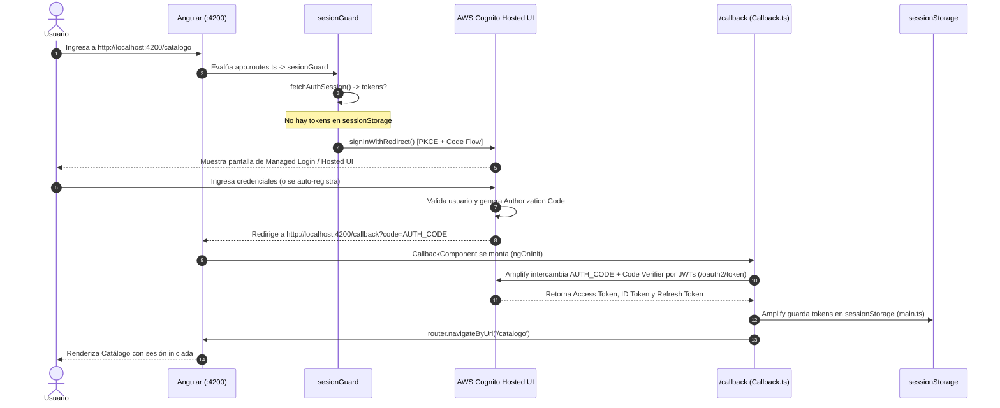
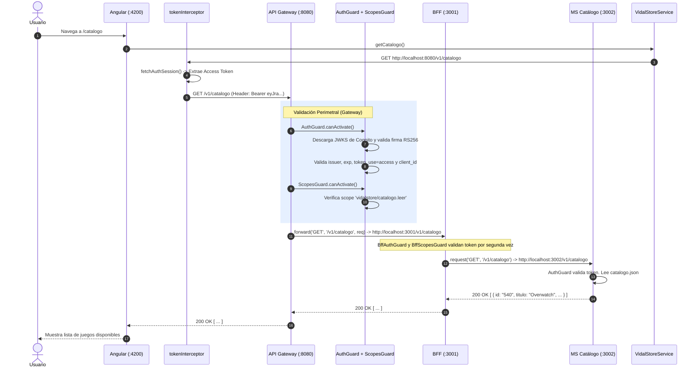
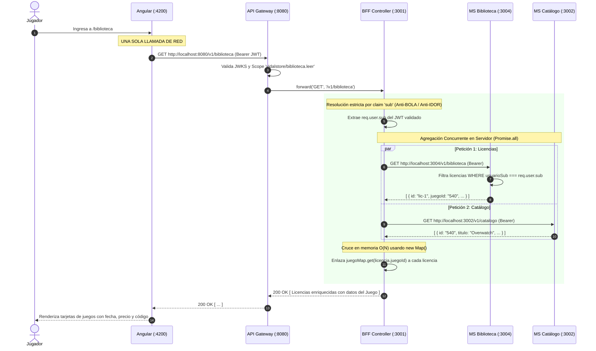
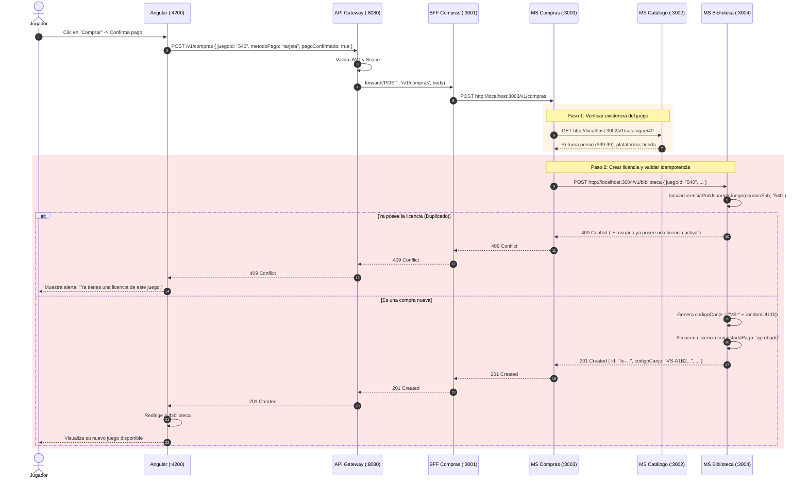
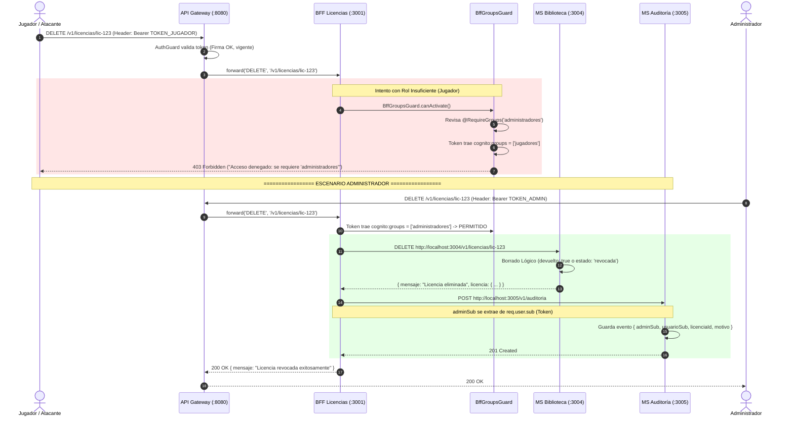

# VidalStore EP1 — Guía Técnica Exhaustiva de Flujos de Punta a Punta

> **Asignatura:** DSY1107 - Desarrollo Cloud Native I (DUOC UC)  
> **Evaluación:** Evaluación Parcial N°1 (EP1) — Caso VidalStore  
> **Propósito:** Documento de estudio, comprensión integral de la arquitectura y defensa técnica individual de 15 minutos.  
> **Repositorios involucrados:** `vidalstore-frontend` (Angular 20), `vidalstore-gateway` (NestJS), `vidalstore-backend` (NestJS BFF y Microservicios), e Identity Provider AWS Cognito.

---

## 📑 Índice General de Flujos

1. [Topología de la Arquitectura de 4 Capas y Puertos](#1-topología-de-la-arquitectura-de-4-capas-y-puertos)
2. [Flujo 1 · Identidad, Registro y Autenticación (Flujo A Oficial)](#2-flujo-1--identidad-registro-y-autenticación-flujo-a-oficial)
3. [Flujo 2 · Consulta de Catálogo (Lectura Autenticada con Scopes)](#3-flujo-2--consulta-de-catálogo-lectura-autenticada-con-scopes)
4. [Flujo 3 · Lo Propio: Biblioteca Personal (Flujo B Oficial · Agregación Concurrente)](#4-flujo-3--lo-propio-biblioteca-personal-flujo-b-oficial--agregación-concurrente)
5. [Flujo 4 · Compra de Juego (Transacción Distribuida e Idempotencia 409)](#5-flujo-4--compra-de-juego-transacción-distribuida-e-idempotencia-409)
6. [Flujo 5 · Rol Insuficiente y Revocación Administrativa (Flujo C Oficial · 403 Forbidden)](#6-flujo-5--rol-insuficiente-y-revocación-administrativa-flujo-c-oficial--403-forbidden)
7. [Flujo 6 · Defensa en Profundidad y Acceso "Por Detrás" (Flujo D Oficial · 401 Unauthorized)](#7-flujo-6--defensa-en-profundidad-y-acceso-por-detrás-flujo-d-oficial--401-unauthorized)
8. [Flujo 7 · Origen y Trazabilidad de Datos (Flujo E Oficial · Seed y API Externa)](#8-flujo-7--origen-y-trazabilidad-de-datos-flujo-e-oficial--seed-y-api-externa)
9. [Flujo 8 · Auditoría y Registro de Trazabilidad Administrativa](#9-flujo-8--auditoría-y-registro-de-trazabilidad-administrativa)
10. [Framework de Defensa Verbal en 4 Pasos (El Reloj de 15 Minutos)](#10-framework-de-defensa-verbal-en-4-pasos-el-reloj-de-15-minutos)

---

## 1. Topología de la Arquitectura de 4 Capas y Puertos

```
[ NAVEGADOR WEB (Cliente) ]
       │
       │  http://localhost:4200 (Angular 20 Standalone)
       ▼
┌────────────────────────────────────────────────────────────────────────┐
│ CAPA 1: FRONTEND (vidalstore-frontend)                                 │
│ Puerto: 4200 | Tecnología: Angular 20 Standalone                       │
│ Responsabilidad: Renderizado SPA, guards de ruta, UI reactiva (signals)│
│ Restricción: Habla con UNA SOLA DIRECCIÓN (http://localhost:8080)      │
└──────────────────────────────────┬─────────────────────────────────────┘
                                   │ HTTP con Authorization: Bearer <JWT>
                                   ▼
┌────────────────────────────────────────────────────────────────────────┐
│ CAPA 2: API GATEWAY (vidalstore-gateway)                               │
│ Puerto: 8080 | Tecnología: NestJS                                      │
│ Responsabilidad: Perímetro de seguridad, CORS estricto (4200),         │
│ validación criptográfica JWKS de Cognito, filtrado por Scopes OAuth2   │
└──────────────────────────────────┬─────────────────────────────────────┘
                                   │ HTTP Forward con Authorization: Bearer <JWT>
                                   ▼
┌────────────────────────────────────────────────────────────────────────┐
│ CAPA 3: BACKEND FOR FRONTEND / BFF (vidalstore-backend)                │
│ Puerto: 3001 | Tecnología: NestJS (src/main.ts)                        │
│ Responsabilidad: Orquestación, agregación concurrente (Promise.all),   │
│ resolución de identidad por 'sub', autorización RBAC por grupos        │
└───────┬──────────────────┬──────────────────┬──────────────────┬───────┘
        │                  │                  │                  │
        │ HTTP (Bearer)    │ HTTP (Bearer)    │ HTTP (Bearer)    │ HTTP (Bearer)
        ▼                  ▼                  ▼                  ▼
┌──────────────┐   ┌──────────────┐   ┌──────────────┐   ┌──────────────┐
│  MS CATÁLOGO │   │  MS COMPRAS  │   │MS BIBLIOTECA │   │ MS AUDITORÍA │
│ Puerto: 3002 │   │ Puerto: 3003 │   │ Puerto: 3004 │   │ Puerto: 3005 │
│ Proceso HTTP │   │ Proceso HTTP │   │ Proceso HTTP │   │ Proceso HTTP │
│ Independiente│   │ Independiente│   │ Independiente│   │ Independiente│
└──────────────┘   └──────────────┘   └──────────────┘   └──────────────┘
        ▲                                                        ▲
        └────────────────────── NUBE AWS ────────────────────────┘
                       AWS Cognito User Pool: us-east-1_psIVfR8PP
                       App Client: 12v3u871cpt4r6tqkm3j66en8i
```

---

## 2. Flujo 1 · Identidad, Registro y Autenticación (Flujo A Oficial)

> **Pregunta de Defensa:** _"¿Cómo pasa un usuario anónimo a ser un sujeto identificado en VidalStore?"_

### 2.1 Diagrama de Secuencia



### 2.2 Recorrido Paso a Paso en el Código Real

#### Paso 1: Protección de Rutas en Angular

- **Archivo:** [`vidalstore-frontend/src/app/app.routes.ts`](file:///Users/oscar/Downloads/DUOC/CloudNative/Evaluacion%201/vidalstore-frontend/src/app/app.routes.ts#L11-L15)
- **Código:**
  ```typescript
  export const routes: Routes = [
    { path: '', redirectTo: 'catalogo', pathMatch: 'full' },
    { path: 'catalogo', component: Catalogo , canActivate: [sesionGuard] },
    { path: 'biblioteca', component: Biblioteca, canActivate: [sesionGuard] },
    { path: 'callback', component: Callback },
  ```
- **Explicación:** Las rutas `/catalogo` y `/biblioteca` exigen sesión activa. No hay vistas públicas salvo login/callback.

#### Paso 2: El Guard de Sesión y Redirección a Cognito

- **Archivo:** [`vidalstore-frontend/src/app/auth/session.guard.ts`](file:///Users/oscar/Downloads/DUOC/CloudNative/Evaluacion%201/vidalstore-frontend/src/app/auth/session.guard.ts#L4-L15)
- **Código:**
  ```typescript
  export const sesionGuard: CanActivateFn = async () => {
    const { tokens } = await fetchAuthSession();

    // Si existe un access token válido, permite el acceso a la ruta
    if (tokens?.accessToken) {
      return true;
    }

    // Si no hay sesión, redirige automáticamente al Managed Login de Cognito
    await signInWithRedirect();
    return false;
  };
  ```
- **Explicación:** Si no hay token en `sessionStorage`, ejecuta `signInWithRedirect()`, que genera el desafío criptográfico PKCE (`code_challenge`) y redirige al dominio OAuth2 de Cognito.

#### Paso 3: Configuración de Amplify y `sessionStorage` (Obligatorio por Rúbrica)

- **Archivo:** [`vidalstore-frontend/src/main.ts`](file:///Users/oscar/Downloads/DUOC/CloudNative/Evaluacion%201/vidalstore-frontend/src/main.ts#L13-L31)
- **Código:**

  ```typescript
  Amplify.configure({
    Auth: {
      Cognito: {
        userPoolId: "us-east-1_psIVfR8PP",
        userPoolClientId: "12v3u871cpt4r6tqkm3j66en8i",
        loginWith: {
          oauth: {
            domain: "us-east-1psivfr8pp.auth.us-east-1.amazoncognito.com",
            scopes: [
              "openid",
              "profile",
              "vidalstore/catalogo.leer",
              "vidalstore/catalogo.escribir",
              "vidalstore/biblioteca.leer",
            ],
            redirectSignIn: [`${redirectUri}/callback`],
            redirectSignOut: [redirectUri],
            responseType: "code", // PKCE Authorization Code Grant
          },
        },
      },
    },
  });

  cognitoUserPoolsTokenProvider.setKeyValueStorage(sessionStorage);
  ```

- **Punto Clave de Defensa:** Se usa `cognitoUserPoolsTokenProvider.setKeyValueStorage(sessionStorage)` para corregir la vulnerabilidad forense de almacenar credenciales en `localStorage`. Al cerrar la pestaña, la sesión se destruye automáticamente.

#### Paso 4: Captura del Callback y Redirección al Catálogo

- **Archivo:** [`vidalstore-frontend/src/app/callback/callback.ts`](file:///Users/oscar/Downloads/DUOC/CloudNative/Evaluacion%201/vidalstore-frontend/src/app/callback/callback.ts#L16-L27)
- **Código:**
  ```typescript
  async ngOnInit(): Promise<void> {
    try {
      const { tokens } = await fetchAuthSession();
      if (tokens?.accessToken) {
        await this.router.navigateByUrl('/catalogo');
      } else {
        this.estado.set('No se encontró una sesión activa.');
      }
    } catch {
      this.estado.set('No se pudo validar la sesión. Intenta iniciar sesión nuevamente.');
    }
  }
  ```

#### Paso 5: Resolución de la "Trampa de Cognito" en el Backend

- **Problema:** Al auto-registrarse un usuario mediante Hosted UI, AWS Cognito crea el usuario sin asignarlo a ningún grupo (`cognito:groups` viene vacío o ausente en el payload del JWT).
- **Archivo:** [`vidalstore-backend/src/auth/guards/groups.guard.ts`](file:///Users/oscar/Downloads/DUOC/CloudNative/Evaluacion%201/vidalstore-backend/src/auth/guards/groups.guard.ts#L41-L51)
- **Código Real (Salida A Defensiva):**
  ```typescript
  // Salida A defensiva: Si el token no tiene grupos asignados (ej. auto-registro),
  // se asume en memoria el rol de menor privilegio ('jugadores').
  const rawGroups: string[] =
    Array.isArray(user.grupos) && user.grupos.length > 0
      ? user.grupos
      : Array.isArray(user["cognito:groups"])
        ? user["cognito:groups"]
        : [];
  const userGroups: string[] = rawGroups.length > 0 ? rawGroups : ["jugadores"];
  ```
- **Resultado:** Cualquier usuario recién registrado asume el rol de menor privilegio (`jugadores`), pudiendo comprar y ver su biblioteca, pero quedando bloqueado de las rutas administrativas.

---

## 3. Flujo 2 · Consulta de Catálogo (Lectura Autenticada con Scopes)

> **Pregunta de Defensa:** _"¿Por qué el Gateway permite ver el catálogo y cómo se valida que el token sea auténtico?"_

### 3.1 Diagrama de Secuencia



### 3.2 Recorrido Paso a Paso en el Código Real

#### Paso 1: Llamada en el Servicio Angular

- **Archivo:** [`vidalstore-frontend/src/app/services/vidalstore.ts`](file:///Users/oscar/Downloads/DUOC/CloudNative/Evaluacion%201/vidalstore-frontend/src/app/services/vidalstore.ts#L61-L64)
- **Código:**
  ```typescript
  getCatalogo(): Observable<Juego[]> {
    return this.http.get<Juego[]>(`${this.gatewayUrl}/v1/catalogo`);
  }
  ```
- **Regla Estricta:** La URL apunta **exclusivamente** a `http://localhost:8080` (Gateway).

#### Paso 2: Interceptor Inyecta el JWT en la Cabecera

- **Archivo:** [`vidalstore-frontend/src/app/auth/token.interceptor.ts`](file:///Users/oscar/Downloads/DUOC/CloudNative/Evaluacion%201/vidalstore-frontend/src/app/auth/token.interceptor.ts#L5-L24)
- **Código:**

  ```typescript
  const PERMITIDOS = ["http://localhost:8080"];

  export const tokenInterceptor: HttpInterceptorFn = (req, next) => {
    const esPermitido =
      PERMITIDOS.some((base) => req.url.startsWith(base)) ||
      req.url.startsWith("/v1");
    if (!esPermitido) {
      return next(req);
    }

    return from(fetchAuthSession()).pipe(
      switchMap(({ tokens }) => {
        const jwt = tokens?.accessToken?.toString();
        const setHeaders: Record<string, string> = {
          "ngrok-skip-browser-warning": "true",
        };
        if (jwt) {
          setHeaders["Authorization"] = `Bearer ${jwt}`;
        }
        return next(req.clone({ setHeaders }));
      }),
    );
  };
  ```

#### Paso 3: Validación Criptográfica en el Gateway (`AuthGuard` + `AuthService`)

- **Archivo:** [`vidalstore-gateway/src/gateway.controller.ts`](file:///Users/oscar/Downloads/DUOC/CloudNative/Evaluacion%201/vidalstore-gateway/src/gateway.controller.ts#L24-L30)
- **Código:**
  ```typescript
  @Get('catalogo')
  @UseGuards(AuthGuard, ScopesGuard)
  @RequireScopes('vidalstore/catalogo.leer')
  async getCatalogo(@Request() req: ExpressRequest) {
    return this.gatewayService.forward('GET', '/v1/catalogo', req);
  }
  ```
- **Archivo:** [`vidalstore-gateway/src/auth/auth.service.ts`](file:///Users/oscar/Downloads/DUOC/CloudNative/Evaluacion%201/vidalstore-gateway/src/auth/auth.service.ts#L20-L66)
  1. Extrae el `kid` del header del token.
  2. Obtiene la clave pública desde el JWKS de AWS Cognito (`jwks-rsa`).
  3. Ejecuta `jwt.verify(token, publicKey, { algorithms: ['RS256'], issuer })`.
  4. Valida que `payload.token_use === 'access'`.
  5. Valida que `payload.client_id === process.env.COGNITO_CLIENT_ID`.
  6. Si alguna falla, lanza `UnauthorizedException` (`401`).

#### Paso 4: Validación de Scopes en el Gateway (`ScopesGuard`)

- **Archivo:** [`vidalstore-gateway/src/auth/scopes.guard.ts`](file:///Users/oscar/Downloads/DUOC/CloudNative/Evaluacion%201/vidalstore-gateway/src/auth/scopes.guard.ts#L33-L47)
- **Código:**

  ```typescript
  const tokenScopeString: string = user.scope || "";
  const userScopes = tokenScopeString
    .split(" ")
    .map((s) => s.trim())
    .filter(Boolean);

  const hasAllScopes = requiredScopes.every((scope) =>
    userScopes.includes(scope),
  );
  if (!hasAllScopes) {
    throw new ForbiddenException(
      `Acceso denegado: falta el scope requerido...`,
    );
  }
  ```

#### Paso 5: Forward y Despacho del Microservicio Catálogo

- **Archivo:** [`vidalstore-gateway/src/gateway.service.ts`](file:///Users/oscar/Downloads/DUOC/CloudNative/Evaluacion%201/vidalstore-gateway/src/gateway.service.ts#L14-L37)
  - Hace fetch a `http://localhost:3001/v1/catalogo` reenviando el `Authorization: Bearer <token>`.
- **Archivo:** [`vidalstore-backend/src/bff/catalogo/bff-catalogo.controller.ts`](file:///Users/oscar/Downloads/DUOC/CloudNative/Evaluacion%201/vidalstore-backend/src/bff/catalogo/bff-catalogo.controller.ts#L29-L39)
  - Reenvía la petición al microservicio de Catálogo en `http://localhost:3002/v1/catalogo`.
- **Archivo:** [`vidalstore-backend/src/microservicios/catalogo/catalogo.controller.ts`](file:///Users/oscar/Downloads/DUOC/CloudNative/Evaluacion%201/vidalstore-backend/src/microservicios/catalogo/catalogo.controller.ts#L26-L29)
  - Retorna el catálogo cargado en memoria desde `catalogo.json` con código HTTP `200 OK`.

---

## 4. Flujo 3 · Lo Propio: Biblioteca Personal (Flujo B Oficial · Agregación Concurrente)

> **Pregunta de Defensa:** _"¿Cómo garantiza VidalStore que un jugador solo vea sus propios juegos y cómo se optimiza la consulta?"_

### 4.1 Diagrama de Secuencia



### 4.2 Recorrido Paso a Paso en el Código Real

#### Paso 1: Prohibición de Parámetro `userId` (Prevención de Vulnerabilidad BOLA/IDOR)

- En VidalStore está **estrictamente prohibido** enviar `GET /v1/biblioteca?userId=123` o `GET /v1/biblioteca/usuario/123`.
- Si se aceptara el ID por URL o body, cualquier usuario podría cambiar el número e inspeccionar la biblioteca de otra persona.
- La identidad se extrae **exclusivamente del claim criptográfico `sub`** inalterable del JWT.

#### Paso 2: El Controlador del BFF y la Agregación con `Promise.all`

- **Archivo:** [`vidalstore-backend/src/bff/biblioteca/bff-biblioteca.controller.ts`](file:///Users/oscar/Downloads/DUOC/CloudNative/Evaluacion%201/vidalstore-backend/src/bff/biblioteca/bff-biblioteca.controller.ts#L20-L58)
- **Código:**

  ```typescript
  @Get()
  @UseGuards(BffAuthGuard)
  async obtenerBiblioteca(
    @CurrentUser('sub') usuarioSub: string,
    @Req() req?: any,
  ) {
    if (!usuarioSub) {
      throw new UnauthorizedException(
        'No se pudo resolver la identidad del usuario a partir del claim sub del token.',
      );
    }

    const authHeader = req?.headers?.['authorization'];

    // Agregación concurrente en servidor con Promise.all (latencia max(T1, T2))
    const [licencias, catalogo] = await Promise.all([
      this.bffHttpService.request<Licencia[]>(
        this.bffHttpService.bibliotecaUrl,
        'GET',
        '/v1/biblioteca',
        authHeader,
      ),
      this.bffHttpService
        .request<Juego[]>(
          this.bffHttpService.catalogoUrl,
          'GET',
          '/v1/catalogo',
          authHeader,
        )
        .catch(() => [] as Juego[]),
    ]);

    // Cruce de datos O(N) con Map
    const juegoMap = new Map<string, Juego>(catalogo.map((j) => [j.id, j]));

    return licencias.map((licencia) => ({
      ...licencia,
      juego: juegoMap.get(licencia.juegoId) ?? null,
    }));
  }
  ```

#### Paso 3: Filtrado en el Microservicio de Biblioteca

- **Archivo:** [`vidalstore-backend/src/microservicios/biblioteca/biblioteca.controller.ts`](file:///Users/oscar/Downloads/DUOC/CloudNative/Evaluacion%201/vidalstore-backend/src/microservicios/biblioteca/biblioteca.controller.ts#L23-L27)
- **Código:**
  ```typescript
  @Get()
  obtenerBiblioteca(@Req() req: any) {
    const usuarioSub = req.user?.sub;
    return this.bibliotecaService.buscarLicenciasPorUsuario(usuarioSub);
  }
  ```
- **Regla Semántica HTTP:** Si el usuario no tiene ninguna licencia, retorna **`200 OK` con un arreglo vacío `[]`**. Jamás 404 ni 403 (evita vulnerabilidad de enumeración de recursos).

---

## 5. Flujo 4 · Compra de Juego (Transacción Distribuida e Idempotencia 409)

> **Pregunta de Defensa:** _"¿Qué pasa si un usuario presiona dos veces el botón de comprar o compra un juego que ya tiene?"_

### 5.1 Diagrama de Secuencia



### 5.2 Recorrido Paso a Paso en el Código Real

#### Paso 1: Orquestación en el Microservicio de Compras

- **Archivo:** [`vidalstore-backend/src/microservicios/compras/compras.service.ts`](file:///Users/oscar/Downloads/DUOC/CloudNative/Evaluacion%201/vidalstore-backend/src/microservicios/compras/compras.service.ts#L41-L82)
- **Código:**

  ```typescript
  // 1. Verificar que el juego exista preguntándole al microservicio de Catálogo
  const juego = await this.comprasHttpService.request<{
    precio?: number;
    plataforma?: Licencia["plataforma"];
    tienda?: Licencia["tienda"];
    region?: Licencia["region"];
  }>(
    this.comprasHttpService.catalogoUrl,
    "GET",
    `/v1/catalogo/${juegoId}`,
    token,
  );

  // 2. Crear la licencia en el microservicio de Biblioteca
  const datosLicencia = {
    juegoId,
    plataforma: juego.plataforma,
    tienda: juego.tienda,
    region: juego.region,
    metodoPago,
    referenciaPago: `SIM-${Date.now()}`,
    precioPagado: juego.precio,
    estadoPago: "aprobado" as const,
  };

  return this.comprasHttpService.request<Licencia>(
    this.comprasHttpService.bibliotecaUrl,
    "POST",
    "/v1/biblioteca",
    token,
    datosLicencia,
  );
  ```

#### Paso 2: Validación de Idempotencia y Generación en Biblioteca

- **Archivo:** [`vidalstore-backend/src/microservicios/biblioteca/biblioteca.service.ts`](file:///Users/oscar/Downloads/DUOC/CloudNative/Evaluacion%201/vidalstore-backend/src/microservicios/biblioteca/biblioteca.service.ts#L49-L62)
- **Código:**

  ```typescript
  const licenciaExistente = this.buscarLicenciaPorUsuarioYJuego(
    usuarioSub,
    licenciaDatos.juegoId,
  );
  if (licenciaExistente) {
    throw new ConflictException(
      `El usuario ya posee una licencia activa para el juego con ID '${licenciaDatos.juegoId}'.`,
    );
  }

  return this.storageService.agregarLicencia({
    ...licenciaDatos,
    usuarioSub,
    codigoCanje: `VS-${randomUUID().replaceAll("-", "").slice(0, 16).toUpperCase()}`,
    estadoPago: "aprobado",
  });
  ```

- **Por qué 409 Conflict:** Cumple el estándar REST de idempotencia. Evita cobros dobles y duplicación de licencias para un mismo usuario.

---

## 6. Flujo 5 · Rol Insuficiente y Revocación Administrativa (Flujo C Oficial · 403 Forbidden)

> **Pregunta de Defensa:** _"¿Qué pasa si un atacante envía una petición con un token válido de jugador para revocar una licencia o ver datos de otros?"_

### 6.1 Diagrama de Secuencia



### 6.2 Recorrido Paso a Paso en el Código Real

#### Paso 1: El Guard de Grupos del BFF (`BffGroupsGuard`)

- **Archivo:** [`vidalstore-backend/src/auth/guards/groups.guard.ts`](file:///Users/oscar/Downloads/DUOC/CloudNative/Evaluacion%201/vidalstore-backend/src/auth/guards/groups.guard.ts#L52-L60)
- **Código:**

  ```typescript
  const hasAnyGroup = requiredGroups.some((group) =>
    userGroups.includes(group),
  );

  if (!hasAnyGroup) {
    throw new ForbiddenException(
      `Acceso denegado: se requiere pertenecer a uno de los grupos [${requiredGroups.join(", ")}]. Grupos actuales del usuario: [${userGroups.join(", ")}]`,
    );
  }
  ```

- **Principio de Seguridad:** Demuestra que **la seguridad reside en el servidor**, no en si el botón de revocar está visible o no en Angular.

#### Paso 2: Revocación y Trazabilidad en Auditoría

- **Archivo:** [`vidalstore-backend/src/bff/biblioteca/bff-licencias.controller.ts`](file:///Users/oscar/Downloads/DUOC/CloudNative/Evaluacion%201/vidalstore-backend/src/bff/biblioteca/bff-licencias.controller.ts#L56-L108)
- **Código:**

  ```typescript
  @Delete(':licenciaId')
  @UseGuards(BffAuthGuard, BffGroupsGuard)
  @RequireGroups('administradores')
  async revocarLicencia(
    @Param('licenciaId') licenciaId: string,
    @CurrentUser('sub') adminSub: string,
    @Req() req?: any,
  ) {
    // 1. Eliminar licencia en microservicio de biblioteca
    const deleteResult = await this.bffHttpService.request<{
      mensaje: string;
      licencia: Licencia;
    }>(
      this.bffHttpService.bibliotecaUrl,
      'DELETE',
      `/v1/licencias/${licenciaId}`,
      authHeader,
    );

    // 2. Registrar evento en microservicio de auditoría
    await this.bffHttpService.request(
      this.bffHttpService.auditoriaUrl,
      'POST',
      '/v1/auditoria',
      authHeader,
      {
        adminSub: adminSub || 'admin',
        usuarioSub: licencia?.usuarioSub || 'desconocido',
        juegoId: licencia?.juegoId || 'desconocido',
        licenciaId,
        motivo: 'Revocación administrativa',
      },
    );
  ```

---

## 7. Flujo 6 · Defensa en Profundidad y Acceso "Por Detrás" (Flujo D Oficial · 401 Unauthorized)

> **Pregunta de Defensa:** _"Si un atacante descubre la IP y el puerto del BFF (3001) o de un microservicio (3004) y se salta el Gateway, ¿puede acceder a los datos?"_

### 7.1 Matriz de Comportamiento Defensivo

| Intento de Ataque             | Destino                 | Cabecera / Condición       |  Código de Respuesta   | Componente que corta       |
| ----------------------------- | ----------------------- | -------------------------- | :--------------------: | -------------------------- |
| Petición sin token            | Gateway (`:8080`)       | Sin `Authorization`        | **`401 Unauthorized`** | `Gateway AuthGuard`        |
| Petición sin token directa    | BFF (`:3001`)           | Sin `Authorization`        | **`401 Unauthorized`** | `BFF BffAuthGuard`         |
| Petición sin token directa    | MS Biblioteca (`:3004`) | Sin `Authorization`        | **`401 Unauthorized`** | `Microservicio AuthGuard`  |
| Token con firma alterada      | Gateway o BFF           | Firma adulterada           | **`401 Unauthorized`** | `AuthService.validarToken` |
| Token de otra App (Client 2)  | Gateway o BFF           | `client_id` diferente      | **`401 Unauthorized`** | `AuthService.validarToken` |
| Petición cross-origin directa | BFF o Microservicio     | Desde navegador (`Origin`) |    **Bloqueo CORS**    | No tienen CORS habilitado  |

### 7.2 Recorrido en el Código Real

#### 1. Validación en el Salto del Perímetro (Gateway)

- **Archivo:** [`vidalstore-gateway/src/auth/auth.guard.ts`](file:///Users/oscar/Downloads/DUOC/CloudNative/Evaluacion%201/vidalstore-gateway/src/auth/auth.guard.ts#L18-L24)
- **Código:**
  ```typescript
  if (!token) {
    throw new UnauthorizedException("No se encontró token Bearer");
  }
  const payload = await this.authService.validateToken(token);
  ```

#### 2. Validación en el Segundo Salto (BFF y Microservicios - "Cierre por Detrás")

- **Archivo:** [`vidalstore-backend/src/auth/guards/auth.guard.ts`](file:///Users/oscar/Downloads/DUOC/CloudNative/Evaluacion%201/vidalstore-backend/src/auth/guards/auth.guard.ts#L24-L34)
- **Código:**
  ```typescript
  if (!authHeader || !authHeader.startsWith("Bearer ")) {
    throw new UnauthorizedException(
      "Cabecera Authorization ausente o con formato inválido (debe iniciar con Bearer <token>)",
    );
  }
  const payload = await this.authService.validarToken(token);
  ```

#### 3. Rechazo de Token de Otro App Client

- **Archivo:** [`vidalstore-backend/src/auth/auth.service.ts`](file:///Users/oscar/Downloads/DUOC/CloudNative/Evaluacion%201/vidalstore-backend/src/auth/auth.service.ts#L57-L67)
- **Código:**
  ```typescript
  const expectedClientId = process.env.COGNITO_CLIENT_ID;
  if (
    expectedClientId &&
    cognitoPayload.client_id &&
    cognitoPayload.client_id !== expectedClientId
  ) {
    throw new UnauthorizedException(
      `Client ID no autorizado: el token pertenece a '${cognitoPayload.client_id}', pero se esperaba '${expectedClientId}'`,
    );
  }
  ```

#### 4. CORS Estricto Únicamente en el Gateway

- **Archivo:** [`vidalstore-gateway/src/main.ts`](file:///Users/oscar/Downloads/DUOC/CloudNative/Evaluacion%201/vidalstore-gateway/src/main.ts#L12-L16)
- **Código:**
  ```typescript
  app.enableCors({
    origin: "http://localhost:4200",
    methods: ["GET", "POST", "PUT", "DELETE", "OPTIONS"],
    allowedHeaders: [
      "Content-Type",
      "Authorization",
      "ngrok-skip-browser-warning",
    ],
  });
  ```
- **Archivo:** [`vidalstore-backend/src/main.ts`](file:///Users/oscar/Downloads/DUOC/CloudNative/Evaluacion%201/vidalstore-backend/src/main.ts#L8-L10)
  - Prohibido activar CORS en BFF o microservicios.

---

## 8. Flujo 7 · Origen y Trazabilidad de Datos (Flujo E Oficial · Seed y API Externa)

> **Pregunta de Defensa:** _"¿De dónde salieron los datos del catálogo que estamos viendo en pantalla?"_

### 8.1 Recorrido en el Código Real

- **Comando:** `npm run seed` en `vidalstore-backend`
- **Archivo:** [`vidalstore-backend/data/seed.ts`](file:///Users/oscar/Downloads/DUOC/CloudNative/Evaluacion%201/vidalstore-backend/data/seed.ts#L90-L160)
- **Operación:**
  1. Realiza una petición `fetch` a la API real de juegos: `https://www.freetogame.com/api/games`.
  2. Mapea los atributos externos al modelo institucional `Juego` de VidalStore (`id`, `titulo`, `descripcion`, `precio`, `estado`, `imagen`, `plataforma`, `tienda`, `region`).
  3. Contiene un arreglo de respaldo (`FALLBACK_JUEGOS`) que garantiza resiliencia en caso de que la red del laboratorio de DUOC tenga bloqueo de firewall hacia internet.
  4. Escribe el archivo versionado [`vidalstore-backend/data/catalogo.json`](file:///Users/oscar/Downloads/DUOC/CloudNative/Evaluacion%201/vidalstore-backend/data/catalogo.json).
  5. Los microservicios inyectan este JSON al arrancar mediante `MemoryStorageService`.

---

## 9. Flujo 8 · Auditoría y Registro de Trazabilidad Administrativa

> **Requisito Obligatorio:** Grupos de 3 integrantes (David, Oscar e Iván).

### 9.1 Recorrido en el Código Real

- **Microservicio:** `vidalstore-backend/src/microservicios/auditoria` (Puerto `3005`).
- **Archivo:** [`vidalstore-backend/src/microservicios/auditoria/auditoria.controller.ts`](file:///Users/oscar/Downloads/DUOC/CloudNative/Evaluacion%201/vidalstore-backend/src/microservicios/auditoria/auditoria.controller.ts#L28-L33)
- **Registro Inmutable:**
  ```typescript
  @Post()
  @HttpCode(HttpStatus.CREATED)
  registrarAuditoria(@Body() dto: RegistrarAuditoriaDto) {
    return this.auditoriaService.registrarAuditoria(dto);
  }
  ```
- **Campos registrados:**
  - `id`: Identificador autoincremental o UUID.
  - `adminSub`: Extraído del claim `sub` del administrador que ejecutó la acción.
  - `usuarioSub`: Sujeto al que se le aplicó la acción (ej: usuario cuya licencia fue revocada).
  - `juegoId` / `licenciaId`: Identificadores de negocio afectados.
  - `motivo`: Descripción de la operación.
  - `timestamp`: Marca de tiempo ISO-8601.

---

## 10. Framework de Defensa Verbal en 4 Pasos (El Reloj de 15 Minutos)

Durante los 15 minutos cronometrados de la defensa individual de la EP1, cuando el profesor Umbingelelo te ponga el cursor sobre un archivo o te pregunte por qué hiciste algo, responde usando esta estructura exacta de 1 minuto:

```
┌────────────────────────────────────────────────────────────────────────┐
│ PASO 1: QUÉ HICE                                                       │
│ "En [nombre del archivo], definí [nombre de la clase/función]..."     │
├────────────────────────────────────────────────────────────────────────┤
│ PASO 2: QUÉ PROBLEMA RESUELVE                                          │
│ "Esto resuelve [problema de seguridad/rendimiento/arquitectura]..."    │
├────────────────────────────────────────────────────────────────────────┤
│ PASO 3: QUÉ DESCARTÉ (El que más pesa)                                │
│ "Descarté [alternativa rechazada] porque [motivo técnico concreto]..." │
├────────────────────────────────────────────────────────────────────────┤
│ PASO 4: CÓMO LO COMPRUEBO                                              │
│ "Lo demuestro aquí en la pantalla con [curl / Pestaña Red / Token]..." │
└────────────────────────────────────────────────────────────────────────┘
```

### Ejemplos Prácticos Listos para Usar en la Defensa:

#### Caso A: Resolución de Biblioteca por `sub`

1. **Qué hice:** En `bff-biblioteca.controller.ts` línea 23, inyecté el claim `sub` con `@CurrentUser('sub')`.
2. **Qué problema resuelve:** Evita vulnerabilidades de BOLA/IDOR (Broken Object Level Authorization). Ningún jugador puede ver la biblioteca de otro.
3. **Qué descarté:** Descarté recibir el `userId` como parámetro de ruta o query (`/biblioteca?userId=xxx`).
4. **Cómo lo compruebo:** Muestro en la pestaña Red que Angular solo llama a `/v1/biblioteca` sin parámetros y el backend devuelve únicamente mis juegos.

#### Caso B: Guardado en `sessionStorage`

1. **Qué hice:** En `main.ts` de Angular línea 31, configuré `cognitoUserPoolsTokenProvider.setKeyValueStorage(sessionStorage)`.
2. **Qué problema resuelve:** Protege los tokens de persistencia indebida. Si el usuario cierra el navegador o pestaña, el token se borra automáticamente.
3. **Qué descarté:** Descarté `localStorage` (hallazgo forense del caso) y cookies no seguras.
4. **Cómo lo compruebo:** Abro la pestaña `Application` en DevTools y muestro los tokens en `Session Storage`, mientras `Local Storage` se encuentra vacío.

#### Caso C: Agregación en el BFF con `Promise.all`

1. **Qué hice:** En `bff-biblioteca.controller.ts` línea 35, ejecuté `Promise.all` para consultar concurrentemente al microservicio de Biblioteca y Catálogo.
2. **Qué problema resuelve:** Reduce la latencia al tiempo del servicio más lento (`max(T1, T2)` en lugar de `T1 + T2`) y evita que el frontend haga múltiples viajes de red.
3. **Qué descarté:** Descarté llamadas secuenciales con `await` encadenados y descarté que Angular llamara directamente a los dos microservicios.
4. **Cómo lo compruebo:** Inspecciono la pestaña Red del navegador para demostrar que el navegador hace una sola petición HTTP y recibe el JSON completo con los datos del juego ya cruzados.
