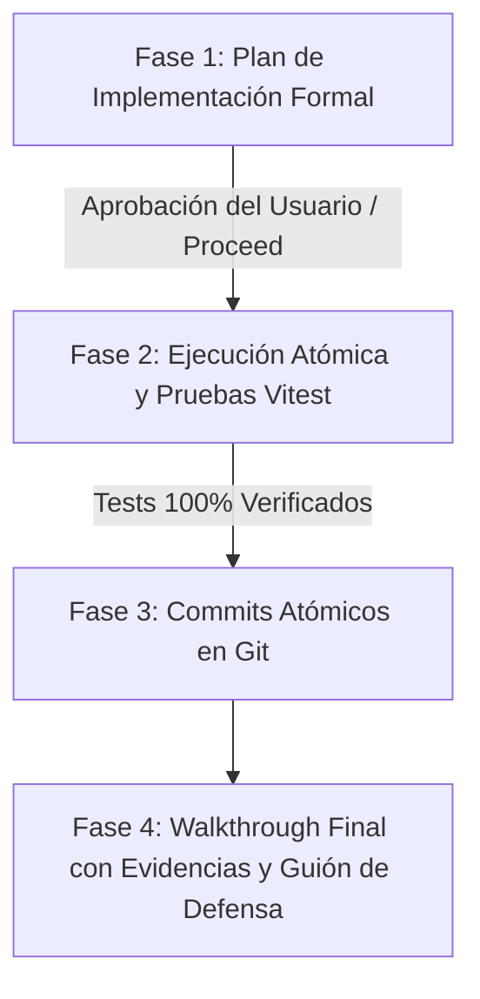

# Metodología de Trabajo Estándar: Plan de Implementación y Walkthrough

Esta metodología establece el **estándar de ingeniería de software y control de calidad** que debe seguirse obligatoriamente antes y después de implementar cualquier rama (`feature/*`, `fix/*`, `refactor/*`) en los microservicios de VidalStore (`vidalstore-admin`, `vidalstore-eventos`, `vidalstore-plataforma`).

---

## 1. El Ciclo de Vida de una Feature (Flujo de 3 Fases)



1. **Fase 1 (Antes de tocar código)**: Elaborar el **Plan de Implementación** estructurado, guardado como artefacto interactivo con `RequestFeedback: true`.
2. **Fase 2 (Durante el desarrollo)**: Ejecutar paso a paso cada fase del plan, creando interfaces, lógica de negocio, manejo de excepciones y pruebas unitarias aisladas.
3. **Fase 3 (Control de versiones)**: Realizar commits estrictamente atómicos con prefijo semántico en minúsculas y modo imperativo en español, siempre previa autorización.
4. **Fase 4 (Cierre y verificación)**: Generar un **Walkthrough** técnico que demuestre con pruebas, logs y diagramas que el código cumple al 100% con la rúbrica y prepara al estudiante para su defensa de 15 minutos.

---

## 2. Plantilla Oficial: Plan de Implementación

Cada plan de implementación debe seguir esta estructura obligatoria:

```markdown
# Plan de Implementación: `[nombre-de-la-rama]`

**Microservicio:** `[nombre-del-microservicio]` (puerto `:XXXX`, Stack)  
**Responsable:** `[Nombre del integrante]`  
**Rama Git:** `[feature/nombre-de-rama]` (origen: `dev`)  
**Indicadores Asociados:** **IE...** (% encargo), **IE...** (% defensa).  
**Objetivo:** `[Resumen técnico conciso de lo que resuelve la rama y qué problema previene]`.

---

## 1. Contexto y Requisitos de Rúbrica
* **Indicador Encargo:** Texto textual de la rúbrica y porcentaje.
* **Indicador Defensa:** Texto textual de la rúbrica y porcentaje.
* **Reglas del Negocio / Normativa:** Cita de EP1-aclaraciones, D8, L7 o L7A aplicable.

---

## 2. Diagrama de Arquitectura / Flujo (Mermaid)
[Diagrama secuencial o de componentes mostrando interacciones, capas y puntos de fallo]

---

## 3. Fases de Implementación Paso a Paso

### Paso 0: Control de Versiones y Rama
* Comando Git a solicitar: `git checkout -b feature/... dev`
* Verificación previa de estado limpio.

### Paso 1: Configuración, Entorno y Modelado de Tipos
* Modificaciones en `.env` y `.env.example`.
* Contratos e interfaces TypeScript (`*.interface.ts`, DTOs con `class-validator`).

### Paso 2: Implementación de la Capa de Servicio / Lógica Core
* Métodos públicos y firmas de funciones.
* Resiliencia y manejo defensivo de errores (400, 404, 503; nunca 500 ciego).

### Paso 3: Exposición en Controladores / Consumers
* Rutas, verbos HTTP y decoradores de autenticación JWT / Guards.
* Desacoplamiento total (cumplimiento de IE3 o IE7).

### Paso 4: Suite de Pruebas Unitarias con Vitest
* Archivos `*.spec.ts` con mocks de red o broker.
* Casos de prueba: camino feliz, errores de validación, recursos inexistentes y caídas de infraestructura.

### Paso 5: Commits Atómicos Propuestos
1. `feat: [Descripción paso 1]`
2. `feat: [Descripción paso 2]`
3. `refactor: [Descripción paso 3]`
4. `test: [Descripción pruebas unitarias]`
```

---

## 3. Plantilla Oficial: Walkthrough de Cierre

El Walkthrough documenta la entrega terminada y sirve como la guía de estudio para la defensa técnica individual:

```markdown
# Walkthrough de Cierre: `[nombre-de-la-rama]`

## 1. Resumen de Cambios Realizados
* Listado de archivos creados y modificados con enlaces `file://`.
* Principales decisiones de diseño adoptadas.

## 2. Evidencia de Pruebas Unitarias y Cobertura
* Captura o salida textual completa del comando `npm test` o `vitest run`.
* Verificación de que el 100% de los tests pasan sin fallas.

## 3. Demostración de Resiliencia y Manejo de Errores (IE17)
* Casos HTTP probados:
  * Petición exitosa (200 / 201).
  * Payload inválido (400 Bad Request detallando el campo exacto).
  * Recurso inexistente (404 Not Found).
  * Caída de RabbitMQ / BD (503 Service Unavailable).

## 4. Guión de Defensa Técnica para el Profesor (Preguntas y Respuestas)
* **Pregunta probable del profesor:** [Ej. ¿Por qué el controller no llama directamente a amqplib?]
  * **Respuesta técnica recomendada:** [Explicación basada en IE7 y desacoplamiento].
* **Pregunta probable de métricas:** [Ej. ¿Qué indica un valor alto en messages_unacknowledged?]
  * **Respuesta técnica recomendada:** [Explicación basada en D8 y L7A].

## 5. Historial de Commits Atómicos Aplicados
* `git log -n X --oneline` mostrando los commits semánticos en español e imperativo.
```

---

## 4. Criterios de Aceptación Innegociables para el Asistente

1. **Nunca programar a ciegas**: Antes de escribir código para una feature compleja o rama, se debe presentar el Plan de Implementación al usuario para su revisión y confirmación.
2. **Prohibido modificar Git sin permiso**: Nunca ejecutar `git checkout`, `git commit` o `git merge` sin explicar qué hace el comando y solicitar autorización explícita.
3. **Manejo de Errores en Toda Capa (IE17)**: Prohibido capturar errores y devolver `500 Internal Server Error` sin mensaje descriptivo; transformar siempre a excepciones semánticas de NestJS (`NotFoundException`, `BadRequestException`, `ServiceUnavailableException`).
4. **Cierre Obligatorio con Walkthrough**: Al finalizar el desarrollo y pasar los tests, siempre entregar el Walkthrough técnico con el resumen de cambios, salida de tests y guía para la defensa.
